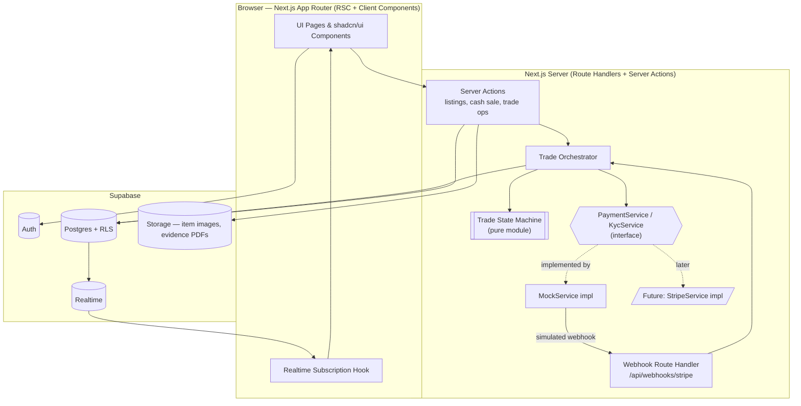
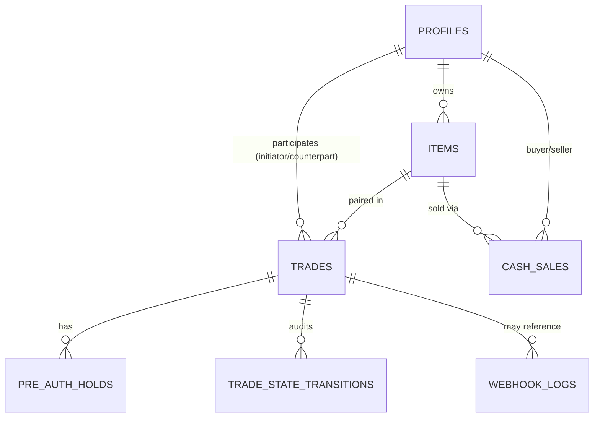

# Design Document

## Overview

CardTrade is a safety-first P2P clearinghouse for collectibles built as a **frontend-first hackathon MVP**. The full experience — registration, KYC, listings, cash sales, the 2-way trade escrow lifecycle, dispute/fraud resolution, and a real-time trade contract view — is delivered in the UI. All payment, KYC, and webhook behavior is provided by a **Mock_Service** that deterministically simulates the Stripe REST API and Stripe Identity KYC.

The central design goal is a **clean seam between three concerns**:

1. **The Trade State Machine** — a pure, dependency-free module that owns all Trade_State transition rules. It has no knowledge of the database, the UI, or the payment provider. This makes it independently and exhaustively testable (including property-based testing).
2. **The Payment/KYC Service Interface** — a single TypeScript contract (`PaymentService` + `KycService`) that both `MockService` (this phase) and a future `StripeService` (later phase) implement. The rest of the system depends only on the interface, never on the concrete implementation.
3. **The UI + Persistence layer** — Next.js App Router pages/components backed by Supabase (Postgres, Auth, Storage, Realtime), which orchestrate the state machine and the service interface and reflect state live.

This separation is what lets the real Stripe integration "slot in later" with no changes to the state machine or UI: only the concrete service binding changes.

### Key Design Decisions

| Decision | Rationale |
|----------|-----------|
| Pure, side-effect-free state machine module | Enables exhaustive unit + property-based testing of transition integrity (Req 9) independent of UI/DB/mock. |
| Single `PaymentService`/`KycService` interface with Mock + future Stripe impls | Satisfies "swap real Stripe in later" without touching orchestration, UI, or state machine (all MVP notes). |
| Supabase Realtime **Postgres Changes** on `trades` | Simplest path to the real-time contract view (Req 11) for a hackathon; noted upgrade path to Broadcast for scale. [Supabase docs](https://supabase.com/docs/guides/realtime/subscribing-to-database-changes) |
| Row-Level Security (RLS) as the primary authorization mechanism | Enforces per-owner Profile/Item access and per-participant Trade access (Req 1.6, 3.7, 9.6-9.7) at the database, not just the UI. |
| State transitions committed via a guarded DB write with optimistic concurrency (version column) | Guarantees exactly-one-wins concurrency (Req 9.3-9.4) and an append-only audit trail (Req 9.5). |
| Webhook handler as a Next.js Route Handler with idempotency keyed on `event_id` | Provides authenticity stub, idempotency, and single-dispatch into the state machine (Req 10). |

### Research Notes

- **Supabase Realtime** offers two mechanisms: *Postgres Changes* (simple, listens to WAL-level row changes, less scalable) and *Broadcast* (recommended for scale/security). For an MVP the Postgres Changes approach on the `trades` and `pre_auth_holds` tables is the least-effort way to satisfy the < 5s live-update requirement (Req 11.2). Tables must be added to the `supabase_realtime` publication. Source: [Supabase — Subscribing to Database Changes](https://supabase.com/docs/guides/realtime/subscribing-to-database-changes). Content was rephrased for compliance with licensing restrictions.
- **Supabase clients in Next.js** follow a three-client pattern: a browser client for Client Components, a server client (cookie-bound) for Server Components/Actions, and an admin (service-role) client that bypasses RLS for trusted server tasks such as the webhook handler. Source: [MakerKit — Supabase Clients in Next.js](https://makerkit.dev/docs/next-supabase-turbo/data-fetching/supabase-clients). Content was rephrased for compliance with licensing restrictions.
- **Property-based testing** in TypeScript is well served by [`fast-check`](https://fast-check.dev), which integrates with Vitest/Jest and supports model-based (stateful) testing — a strong fit for verifying state machine transition integrity.

## Architecture

### System Context



### Layered Responsibilities

- **Presentation (Client + Server Components):** Renders catalog, listing forms, cash sale flow, trade proposal, and the real-time trade contract view. Derives *which actions to show* from the state machine's `availableActions(state, viewer)` helper so the UI never hard-codes transition rules (Req 11.3-11.4).
- **Orchestration (Server Actions + Trade Orchestrator):** The only layer that combines the state machine, the service interface, and persistence. It (a) validates the requested action against the state machine, (b) calls the `PaymentService`/`KycService` as needed, and (c) commits the resulting state via a guarded write with an audit row.
- **Domain (Trade State Machine):** Pure functions. No I/O. Owns the transition table, guards, and terminal-state rules.
- **Integration (Service Interface + Mock):** `MockService` returns deterministic simulated results and can emit simulated webhooks (auto or UI-triggered). Swappable for `StripeService`.
- **Data (Supabase):** Postgres tables + RLS, Storage for images, Realtime for live trade updates.

### Request/Event Flows

**UI-driven action (e.g., record shipment):**
```
Client → Server Action → Orchestrator → StateMachine.canTransition() 
       → [PaymentService call if needed] → guarded DB write (+ audit row) 
       → Postgres Changes → Realtime → Client re-render
```

**Simulated webhook (e.g., pre-auth confirmed):**
```
MockService (auto or UI "Fire Webhook") → POST /api/webhooks/stripe 
       → verify authenticity (stub) → idempotency check on event_id 
       → map event → StateMachine.transition() → guarded DB write (+ audit + webhook_log) 
       → Realtime → Client re-render
```

### Next.js App Router Structure

The app uses the App Router with Server Components by default and Client Components only where interactivity/realtime is needed. Server Actions handle mutations; a Route Handler handles webhooks.

## Components and Interfaces

### 1. Payment/KYC Service Interface (the contract)

This is the seam that lets the real Stripe integration replace the mock later. Both `MockService` and the future `StripeService` implement these interfaces. All amounts are integer **cents (AUD)** to avoid floating-point drift.

```typescript
// domain/services/types.ts

export type Cents = number; // integer AUD cents

export interface Payer {
  payerId: string;
  profileId: string;
}

export interface PreAuthHold {
  holdId: string;
  payerId: string;
  amount: Cents;
  status: 'ACTIVE' | 'VOIDED' | 'PARTIALLY_CAPTURED' | 'FULLY_CAPTURED' | 'FAILED';
}

export interface CaptureResult {
  captureId: string;
  holdId: string;
  amount: Cents;
  status: 'SETTLED' | 'FAILED';
}

export interface TransferResult {
  transferId: string;
  amount: Cents;
  status: 'SETTLED' | 'FAILED';
}

export interface KycResult {
  payerId: string;
  outcome: 'VERIFIED' | 'REJECTED';
  reason?: string;
}

/**
 * The MINIMUM identity the platform holds (Req 2.5). Narrower than what the
 * provider returns: `dob`, `id_number` and `id_number_type` are deliberately
 * never retrieved, because the only consumer of them was the withdrawn
 * Police_Evidence_Pack. `isAdult` is derived from the verified date of birth at
 * read time and the date itself is discarded.
 */
export interface VerifiedIdentitySummary {
  legalName: string; // gated — Commitment_Point disclosure only
  firstName: string; // public, shown with the verified badge
  isAdult: boolean;
  verifiedAt: string;
}

/** Provider-hosted, asynchronous identity check (Req 2.2). */
export interface IdentityCheckSession {
  sessionId: string;
  url: string;
}

/** Payment provider contract — implemented by MockService now, StripeService later. */
export interface PaymentService {
  createPayer(profileId: string): Promise<Payer>;
  requestTransfer(params: { payerId: string; amount: Cents; ref: string }): Promise<TransferResult>;
  placeHold(params: { payerId: string; amount: Cents; ref: string }): Promise<PreAuthHold>;
  voidHold(holdId: string): Promise<PreAuthHold>;
  partialCapture(params: { holdId: string; amount: Cents }): Promise<CaptureResult>;
  fullCapture(holdId: string): Promise<CaptureResult>;
}

/** KYC contract — implemented by MockService now, Stripe Identity later. */
export interface KycService {
  createPayer(profileId: string): Promise<Payer>;              // KYC begins with payer creation (Req 2.1)
  runVerification(payerId: string): Promise<KycResult>;        // simulated verify (Req 2.2, 2.3)
  // Narrow, name-only summary read once from the verification webhook (Req 2.5).
  // Deliberately NOT the date of birth, document type, or document number.
  getIdentitySummary?(sessionId: string): Promise<VerifiedIdentitySummary | null>;
  // Opens the provider-hosted document + selfie check (Req 2.2).
  beginIdentityCheck?(params: { profileId: string; payerId?: string; returnUrl: string }): Promise<IdentityCheckSession>;
}

/** Optional capability the Mock exposes for demo control; NOT part of the production contract. */
export interface WebhookEmitter {
  emit(event: WebhookEvent): Promise<void>;
}
```

### 2. MockService (this phase)

- **Deterministic:** Given the same inputs it produces the same outputs. Outcomes (success/failure) are driven by explicit demo controls (e.g., a `scenario` flag or a per-trade "force failure" toggle in the UI) rather than randomness, so demos and tests are reproducible.
- **UI-triggerable:** The trade contract view exposes demo controls (e.g., "Confirm Holds", "Fire pre_auth.settled webhook", "Simulate Fraud Full Capture"). These call the MockService, which in turn POSTs a `WebhookEvent` to `/api/webhooks/stripe`, exercising the exact same code path a real Stripe webhook would.
- **Simulated webhook emission:** After a payment operation, the Mock enqueues the corresponding `WebhookEvent` (e.g., `hold.active`, `transfer.settled`, `capture.settled`). Emission may be automatic (short timer) or manual (UI button) to make the demo controllable.
- **Signature stub:** The Mock signs webhook payloads with a shared secret using the same header contract the real Stripe integration will use, so the authenticity-verification code path is real even though the secret is local.

```typescript
// domain/services/mock/MockService.ts
export class MockService implements PaymentService, KycService, WebhookEmitter {
  constructor(private opts: { webhookUrl: string; secret: string; scenario?: MockScenario }) {}
  // ...deterministic implementations that also enqueue WebhookEvents
}
```

A single factory decides which implementation is bound, so no caller references a concrete class:

```typescript
// domain/services/index.ts
export function getPaymentService(): PaymentService & KycService {
  return process.env.PAYMENTS_PROVIDER === 'stripe'
    ? new StripeService(/* ... */)   // later phase
    : new MockService(/* ... */);   // this phase
}
```

### 3. Trade State Machine (pure module)

The heart of correctness. No imports of Supabase, React, or the service layer.

```typescript
// domain/state-machine/types.ts
export type TradeState =
  | 'COLLATERAL_PENDING' | 'COLLATERAL_LOCKED' | 'IN_TRANSIT'
  | 'INSPECTION' | 'COMPLETED' | 'DISPUTED' | 'FRAUD_RESOLVED';

export type TradeEvent =
  | 'HOLDS_CONFIRMED'        // both pre-auths active (Req 5.5)
  | 'HOLDS_FAILED'          // hold failed / timeout (Req 5.6)  -> cancellation (terminal for MVP)
  | 'BOTH_SHIPPED'          // Req 6.2
  | 'BOTH_RECEIVED'         // Req 6.4
  | 'BOTH_ACCEPTED'         // Req 6.6
  | 'CONDITION_DISPUTE'     // Req 7.1
  | 'DISPUTE_RESOLVED'      // disputed item returned (Req 7.5)
  | 'FRAUD_CONFIRMED';      // Req 8.1

export const TERMINAL_STATES: ReadonlySet<TradeState> =
  new Set(['COMPLETED', 'FRAUD_RESOLVED']);
```

```typescript
// domain/state-machine/machine.ts
export interface TransitionResult {
  ok: boolean;
  nextState?: TradeState;
  error?: 'INVALID_TRANSITION';
}

/** The single source of truth for valid transitions. */
export const TRANSITIONS: Record<TradeState, Partial<Record<TradeEvent, TradeState>>> = {
  COLLATERAL_PENDING: { HOLDS_CONFIRMED: 'COLLATERAL_LOCKED', HOLDS_FAILED: 'COLLATERAL_PENDING' /* -> cancel */ },
  COLLATERAL_LOCKED:  { BOTH_SHIPPED: 'IN_TRANSIT' },
  IN_TRANSIT:         { BOTH_RECEIVED: 'INSPECTION' },
  INSPECTION:         { BOTH_ACCEPTED: 'COMPLETED', CONDITION_DISPUTE: 'DISPUTED', FRAUD_CONFIRMED: 'FRAUD_RESOLVED' },
  DISPUTED:           { DISPUTE_RESOLVED: 'COMPLETED', FRAUD_CONFIRMED: 'FRAUD_RESOLVED' },
  COMPLETED:          {},   // terminal
  FRAUD_RESOLVED:     {},   // terminal
};

export function canTransition(from: TradeState, event: TradeEvent): boolean {
  return Boolean(TRANSITIONS[from]?.[event]);
}

export function transition(from: TradeState, event: TradeEvent): TransitionResult {
  const next = TRANSITIONS[from]?.[event];
  return next ? { ok: true, nextState: next } : { ok: false, error: 'INVALID_TRANSITION' };
}

/** Drives the UI: which actions the given viewer may take in the current state. */
export function availableActions(state: TradeState, viewer: TradeViewerContext): TradeAction[] { /* ... */ }
```

> Note: `HOLDS_FAILED` results in trade **cancellation** (holds voided, items restored to AVAILABLE per Req 5.6). Cancellation is modeled as a terminal outcome; whether it is a distinct `CANCELLED` state or a flag is an implementation detail confirmed during tasks. The transition table above keeps the seven named states from the requirements as the canonical set.

The state machine exposes **guards** for preconditions that depend on aggregate facts (e.g., "both shipped"). Guards are pure predicates over a `TradeFacts` snapshot (shipment/receipt/acceptance flags, hold statuses) so the orchestrator computes facts from the DB and the machine decides validity:

```typescript
export interface TradeFacts {
  shipped: { initiator: boolean; counterpart: boolean };
  received: { initiator: boolean; counterpart: boolean };
  accepted: { initiator: boolean; counterpart: boolean };
  holdsActive: { initiator: boolean; counterpart: boolean };
}
export function deriveEvent(state: TradeState, facts: TradeFacts): TradeEvent | null { /* ... */ }
```

### 4. Trade Orchestrator (Server Action layer)

Coordinates state machine + services + persistence. Pseudocode for a guarded transition:

```typescript
async function applyEvent(tradeId: string, event: TradeEvent, actorId: string) {
  const trade = await loadTrade(tradeId);                 // includes state + version
  const result = transition(trade.state, event);
  if (!result.ok) return err('INVALID_TRANSITION');       // Req 9.2

  await runSideEffects(trade, event);                     // PaymentService calls (holds/captures/voids)

  const committed = await supabaseAdmin
    .from('trades')
    .update({ state: result.nextState, version: trade.version + 1 })
    .eq('id', tradeId)
    .eq('version', trade.version)                          // optimistic lock -> exactly one wins (Req 9.3)
    .select().single();
  if (!committed) return err('CONCURRENT_MODIFICATION');   // Req 9.4

  await insertTransitionAudit(trade, result.nextState, actorId); // Req 9.5
  return ok(committed);
}
```

### 5. Webhook Route Handler

`app/api/webhooks/stripe/route.ts` — a POST Route Handler using the Supabase **admin** client (webhooks are unauthenticated by end users; authenticity is verified by signature).

Processing pipeline (Req 10):
1. **Verify authenticity** (stub): recompute HMAC over the raw body with the shared secret and compare to the signature header. On mismatch → `401`, no state change, no log write beyond an optional rejected-audit (Req 10.1, 10.2).
2. **Idempotency:** look up `webhook_logs` by `event_id`. If a prior **success** exists, acknowledge `200` without re-dispatching (Req 10.5).
3. **Map event → TradeEvent** (or Cash_Sale update). If no mapping → record `no-op` and ack (Req 10.7).
4. **Dispatch** through the state machine via the orchestrator; record `success`/`failure` outcome in `webhook_logs` (Req 10.3, 10.4, 10.8).
5. Respond within 5s (Req 10.6) — all operations are local/in-region, well under budget.

> Security note: the webhook route is intentionally **unauthenticated by user session** but **authenticated by signature**. This is the correct model for provider callbacks. The signature check is the only thing standing between the public internet and state mutation, so it runs before any side effect.

### 6. Core UI Pages & Components

| Route | Type | Purpose | Requirements |
|-------|------|---------|--------------|
| `/(auth)/sign-up`, `/(auth)/sign-in` | Client + Server Action | Registration & login via Supabase Auth | 1.1-1.3, 1.7 |
| `/profile` | Server + Client form | View/edit Profile; shows KYC_Status | 1.4-1.6 |
| `/kyc` | Client | KYC flow: initiate → PENDING → VERIFIED/REJECTED states, with Mock demo controls | 2.1-2.7 |
| `/listings` | Server Component | Catalog of AVAILABLE items | 3.8 |
| `/listings/new`, `/listings/[id]/edit` | Client + Server Action | Create/edit item, image upload to Storage | 3.1-3.7 |
| `/listings/[id]` | Server + Client | Item detail; "Buy" (cash sale) and "Propose Trade" entry points | 4.1, 5.1 |
| `/sales/[id]` | Server + Client (realtime) | Cash sale flow: PENDING → COMPLETED/FAILED with Mock controls | 4.1-4.7 |
| `/trades/new` | Client + Server Action | Trade proposal (equal-value pairing) | 5.1-5.3 |
| `/trades/[id]` | **Client (realtime)** | **Real-time Trade Contract view** — state, hold status, state-dependent actions, live updates, connection indicator | 11.1-11.5, 6.x, 7.x, 8.x |

**Real-time Trade Contract view** (`/trades/[id]`) is the flagship component:
- Subscribes to Postgres Changes on the `trades` row and its `pre_auth_holds`.
- Renders current `Trade_State` + each hold's status (Req 11.1).
- Uses `availableActions(state, viewer)` to render only permitted controls; renders none when no action is allowed (Req 11.3-11.4).
- Shows a **Live / Reconnecting** indicator based on the Realtime channel status; attempts reconnect on drop (Req 11.5).
- Hosts Mock demo controls (fire webhooks, force outcomes) behind a collapsible "Demo" panel.

### 7. Directory / Project Structure

```
Marketplace/
├── app/
│   ├── (auth)/
│   │   ├── sign-in/page.tsx
│   │   └── sign-up/page.tsx
│   ├── profile/page.tsx
│   ├── kyc/page.tsx
│   ├── listings/
│   │   ├── page.tsx                # catalog
│   │   ├── new/page.tsx
│   │   └── [id]/page.tsx, edit/page.tsx
│   ├── sales/[id]/page.tsx
│   ├── trades/
│   │   ├── new/page.tsx
│   │   └── [id]/page.tsx           # real-time trade contract view
│   ├── api/webhooks/stripe/route.ts # webhook handler
│   └── layout.tsx
├── components/
│   ├── ui/                         # shadcn/ui primitives
│   ├── trade/                      # TradeContract, StateBadge, ActionBar, HoldStatus, DemoPanel
│   ├── listings/                   # ItemCard, ItemForm, Catalog
│   └── kyc/                        # KycFlow
├── domain/                         # framework-free core (unit + property tested)
│   ├── state-machine/              # types.ts, machine.ts, guards.ts, actions.ts
│   ├── services/                   # types.ts (interface), index.ts (factory)
│   │   └── mock/MockService.ts
│   ├── orchestrator/               # tradeOrchestrator.ts, cashSaleOrchestrator.ts
│   └── validation/                 # zod schemas for profile/item/trade inputs
├── lib/
│   ├── supabase/                   # browser.ts, server.ts, admin.ts
│   ├── actions/                    # server actions (thin wrappers over orchestrator)
│   └── realtime/                   # useTradeRealtime hook
├── supabase/
│   ├── migrations/                 # SQL schema + RLS
│   └── seed.sql
└── tests/
    ├── unit/                       # state machine, guards, validation
    ├── property/                   # fast-check property tests
    └── component/                  # UI component tests
```

## Data Models

All monetary values are stored as **integer cents** (`bigint`) columns to avoid floating-point issues; the UI formats to AUD. Timestamps are `timestamptz`.

### Enumerated Types

```sql
create type kyc_status     as enum ('UNVERIFIED','PENDING','VERIFIED','REJECTED');
create type item_status    as enum ('AVAILABLE','RESERVED','SOLD');
create type trade_state    as enum ('COLLATERAL_PENDING','COLLATERAL_LOCKED','IN_TRANSIT','INSPECTION','COMPLETED','DISPUTED','FRAUD_RESOLVED');
create type cash_sale_status as enum ('PENDING','COMPLETED','FAILED');
create type hold_status     as enum ('ACTIVE','VOIDED','PARTIALLY_CAPTURED','FULLY_CAPTURED','FAILED');
create type webhook_outcome as enum ('SUCCESS','FAILURE','NO_OP');
```

### Tables

```sql
-- Profiles (1:1 with auth.users)
create table profiles (
  id            uuid primary key references auth.users(id) on delete cascade,
  display_name  text not null check (char_length(display_name) between 1 and 255),
  contact_email text not null,
  kyc_status    kyc_status not null default 'UNVERIFIED',
  kyc_reason    text,                      -- failure reason (Req 2.3)
  payer_id      text,                      -- Stripe/Mock payer reference (Req 2.1)
  created_at    timestamptz not null default now(),
  updated_at    timestamptz not null default now()
);

-- Items
create table items (
  id            uuid primary key default gen_random_uuid(),
  owner_id      uuid not null references profiles(id) on delete cascade,
  title         text not null check (char_length(title) between 1 and 120),
  description   text not null check (char_length(description) between 1 and 2000),
  category      text not null,
  condition     text not null,
  fmv_cents     bigint not null check (fmv_cents between 1 and 99999999999), -- 0.01 .. 999,999,999.99
  status        item_status not null default 'AVAILABLE',
  image_paths   text[] not null check (array_length(image_paths,1) between 1 and 10),
  created_at    timestamptz not null default now(),
  updated_at    timestamptz not null default now()
);

-- Trades (the aggregate root for the state machine)
create table trades (
  id                    uuid primary key default gen_random_uuid(),
  initiator_id          uuid not null references profiles(id),
  counterpart_id        uuid not null references profiles(id),
  initiator_item_id     uuid not null references items(id),
  counterpart_item_id   uuid not null references items(id),
  state                 trade_state not null default 'COLLATERAL_PENDING',
  version               integer not null default 0,     -- optimistic concurrency (Req 9.3)
  -- lifecycle flags (Req 6)
  initiator_shipped_at    timestamptz, counterpart_shipped_at    timestamptz,
  initiator_received_at   timestamptz, counterpart_received_at   timestamptz,
  initiator_accepted_at   timestamptz, counterpart_accepted_at   timestamptz,
  -- dispute/fraud (Req 7, 8)
  dispute_raised_by     uuid references profiles(id),
  disputed_against      uuid references profiles(id),
  disputed_at           timestamptz,
  fraud_victim_id       uuid references profiles(id),
  -- evidence_pack_path / evidence_pack_complete: DROPPED in 0030. The
  -- Police_Evidence_Pack feature was withdrawn; see Requirement 8.4.
  created_at            timestamptz not null default now(),
  updated_at            timestamptz not null default now(),
  check (initiator_id <> counterpart_id)
);

-- Cash Sales
create table cash_sales (
  id            uuid primary key default gen_random_uuid(),
  item_id       uuid not null references items(id),
  buyer_id      uuid not null references profiles(id),
  seller_id     uuid not null references profiles(id),
  amount_cents  bigint not null,          -- fmv + platform fee
  platform_fee_cents bigint not null,     -- flat (Req 4.7)
  status        cash_sale_status not null default 'PENDING',
  transfer_id   text,
  created_at    timestamptz not null default now(),
  updated_at    timestamptz not null default now()
);

-- Pre-Auth Holds (one per trader per trade)
create table pre_auth_holds (
  id            uuid primary key default gen_random_uuid(),
  trade_id      uuid not null references trades(id) on delete cascade,
  trader_id     uuid not null references profiles(id),
  hold_ref      text,                     -- Stripe/Mock hold id
  amount_cents  bigint not null,
  captured_cents bigint not null default 0,
  status        hold_status not null default 'ACTIVE',
  created_at    timestamptz not null default now(),
  updated_at    timestamptz not null default now()
);

-- Trade State Transitions (append-only audit, Req 9.5)
create table trade_state_transitions (
  id            uuid primary key default gen_random_uuid(),
  trade_id      uuid not null references trades(id) on delete cascade,
  from_state    trade_state not null,
  to_state      trade_state not null,
  requested_by  uuid references profiles(id),
  event         text not null,
  created_at    timestamptz not null default now()
);

-- Webhook Logs (idempotency + outcome, Req 10.3)
create table webhook_logs (
  id            uuid primary key default gen_random_uuid(),
  event_id      text not null unique,     -- idempotency key (Req 10.5)
  event_type    text not null,
  payload       jsonb not null,
  outcome       webhook_outcome not null,
  trade_id      uuid references trades(id),
  created_at    timestamptz not null default now()
);
```

### Entity Relationships



### Row-Level Security (RLS) Policies

RLS is enabled on all user-facing tables. The webhook handler and orchestrator side effects use the **service-role** client, which bypasses RLS; all end-user reads/writes go through RLS.

```sql
alter table profiles       enable row level security;
alter table items          enable row level security;
alter table trades         enable row level security;
alter table webhook_logs   enable row level security;

-- Profiles: only the owner can read/write their own profile (Req 1.6, 1.7)
create policy profiles_owner_select on profiles for select using (auth.uid() = id);
create policy profiles_owner_update on profiles for update using (auth.uid() = id) with check (auth.uid() = id);
create policy profiles_owner_insert on profiles for insert with check (auth.uid() = id);

-- Items: public read of AVAILABLE catalog; owner-only read of own non-available items; owner-only writes (Req 3.4-3.8)
create policy items_catalog_select on items for select
  using (status = 'AVAILABLE' or owner_id = auth.uid());
create policy items_owner_insert on items for insert with check (owner_id = auth.uid());
create policy items_owner_update on items for update using (owner_id = auth.uid()) with check (owner_id = auth.uid());
create policy items_owner_delete on items for delete using (owner_id = auth.uid());

-- Trades: only the two participating traders may read; writes go through service role (Req 9.6, 9.7)
create policy trades_participant_select on trades for select
  using (auth.uid() = initiator_id or auth.uid() = counterpart_id);

-- Webhook logs: no end-user access at all (service role only)
create policy webhook_logs_no_access on webhook_logs for all using (false) with check (false);
```

> Design note: end-user Trade *writes* (ship/receive/accept/dispute/fraud) are routed through Server Actions that call the orchestrator with the service-role client, because a valid write must also (a) pass state-machine validation, (b) trigger payment side effects, and (c) write the audit row atomically. Direct client `UPDATE`s on `trades` are therefore not granted; RLS grants **read** to participants only, which is what the real-time view needs.

## Correctness Properties

*A property is a characteristic or behavior that should hold true across all valid executions of a system — essentially, a formal statement about what the system should do. Properties serve as the bridge between human-readable specifications and machine-verifiable correctness guarantees.*

These properties are a strong fit for property-based testing because the **Trade State Machine, the input validators, and the financial-amount calculations are pure functions** with large or infinite input spaces and clear universal invariants. RLS authorization, KYC/payment side effects, PDF generation, realtime delivery, and timing budgets are covered by integration, example, and smoke tests instead (see Testing Strategy).

The properties below were consolidated during prework reflection to eliminate redundancy — each individual transition-table row (Req 5.5, 6.2, 6.4, 6.6, 7.1, 8.1) is subsumed by the single transition-integrity property below, which quantifies over every `(state, event)` pair.

### Property 1: Transition integrity

*For any* Trade_State `s` and any TradeEvent `e`, `transition(s, e)` succeeds and yields the table-defined next state **if and only if** `e` is defined as valid from `s`; otherwise it returns an invalid-transition error and leaves the state unchanged.

**Validates: Requirements 9.1, 9.2, 5.5, 6.2, 6.4, 6.6, 7.1, 8.1**

### Property 2: Canonical lifecycle reachability

*For any* trade, applying the canonical happy-path event sequence `HOLDS_CONFIRMED → BOTH_SHIPPED → BOTH_RECEIVED → BOTH_ACCEPTED` starting from `COLLATERAL_PENDING` walks exactly through `COLLATERAL_LOCKED → IN_TRANSIT → INSPECTION → COMPLETED`.

**Validates: Requirements 5.5, 6.2, 6.4, 6.6**

### Property 3: Terminal states are absorbing

*For any* terminal Trade_State (`COMPLETED`, `FRAUD_RESOLVED`) and any TradeEvent, no transition is permitted (the state machine never leaves a terminal state).

**Validates: Requirements 9.1**

### Property 4: Lifecycle actions are once-only and state-guarded

*For any* trade and any lifecycle action (record shipment, receipt, or acceptance) performed by a trader, the action is accepted only when the current Trade_State permits it and that trader has not already recorded it; a disallowed or duplicate action is rejected and leaves all shipment/receipt/acceptance records unchanged.

**Validates: Requirements 6.1, 6.3, 6.5, 6.8**

### Property 5: Concurrent transitions have exactly one winner

*For any* set of N concurrent transition attempts against the same trade version, exactly one commit succeeds (advancing the version) and every other attempt is rejected with a concurrent-modification error while the committed state is preserved.

**Validates: Requirements 9.3, 9.4**

### Property 6: Audit completeness

*For any* sequence of transition requests applied to a trade, the number of `trade_state_transitions` rows equals the number of committed transitions, and each row records the correct prior state, new state, requesting trader, and a timestamp.

**Validates: Requirements 9.5**

### Property 7: UI actions match permitted actions

*For any* Trade_State and viewer context, the set of action controls rendered in the trade contract view equals exactly `availableActions(state, viewer)` — and is empty when no action is permitted.

**Validates: Requirements 11.3, 11.4**

### Property 8: KYC initiation guard

*For any* Profile KYC_Status, initiating identity verification is accepted if and only if the status is `UNVERIFIED` or `REJECTED`; initiation from `PENDING` or `VERIFIED` is rejected.

**Validates: Requirements 2.1, 2.7**

### Property 9: Unverified users cannot transact

*For any* Profile whose KYC_Status is not `VERIFIED` (i.e. `UNVERIFIED`, `PENDING`, or `REJECTED`), any attempt to initiate a Cash_Sale or a Trade is rejected with a verification-required error.

**Validates: Requirements 2.4**

### Property 10: Credential validation

*For any* registration credentials, validation is accepted if and only if the email matches `local-part@domain` form and the password length is between 8 and 128 inclusive; otherwise it is rejected identifying the invalid field.

**Validates: Requirements 1.1, 1.3**

### Property 11: Profile update validation preserves prior values on rejection

*For any* profile update where a required field is empty or a text field exceeds 255 characters, the update is rejected identifying the invalid field and the previously stored profile values are unchanged.

**Validates: Requirements 1.4, 1.5**

### Property 12: Item validation

*For any* item submission, validation is accepted if and only if every field is within range (title 1–120, description 1–2000, FMV 1–99,999,999,999 cents, images 1–10, category and condition present); any out-of-range or missing field causes rejection identifying that field.

**Validates: Requirements 3.1, 3.2, 3.3**

### Property 13: Catalog returns only available items

*For any* collection of items with mixed availability statuses, the catalog query returns exactly the items whose status is `AVAILABLE`.

**Validates: Requirements 3.8**

### Property 14: Non-available items are immutable in the guarded fields

*For any* item whose status is not `AVAILABLE`, an update request is rejected and the item's fields — in particular its Fair_Market_Value — remain unchanged.

**Validates: Requirements 3.5, 3.6**

### Property 15: Cash sale amount composition

*For any* two items with Fair_Market_Values `v1` and `v2`, the requested transfer for a cash sale equals that item's FMV plus the flat Platform_Fee, and the Platform_Fee charged is identical regardless of FMV (`fee(v1) == fee(v2)`).

**Validates: Requirements 4.2, 4.7**

### Property 16: Cash sale availability guard

*For any* item whose status is not `AVAILABLE`, initiating a Cash_Sale is rejected with an item-unavailable error and the item's status is unchanged.

**Validates: Requirements 4.5**

### Property 17: Trade proposal guards

*For any* proposed pairing of two items, the proposal is accepted only when both FMV amounts are equal to the cent and both items are `AVAILABLE`; otherwise it is rejected and both items' statuses remain unchanged.

**Validates: Requirements 5.1, 5.2, 5.3**

### Property 18: Pre-auth hold sizing

*For any* trade entering `COLLATERAL_PENDING`, the Pre_Auth_Hold requested for each trader equals 100% of that trader's paired item Fair_Market_Value.

**Validates: Requirements 5.4**

### Property 19: Friction tax is fixed and fully allocated

*For any* Condition_Dispute, the Friction_Tax Partial_Capture equals exactly 2000 cents ($20.00), and on settlement it is allocated as 1000 cents to the counterpart and 1000 cents to the platform, the two shares summing to the captured amount.

**Validates: Requirements 7.2, 7.3**

### Property 20: Disputed holds remain locked until resolution

*For any* trade in `DISPUTED` where the disputed item has not been recorded as returned, the remaining Pre_Auth_Hold of the disputed-against trader and the full Pre_Auth_Hold of the raising trader remain locked.

**Validates: Requirements 7.4**

### Property 21: Fraud capture conserves funds to the victim

*For any* offending trader's Pre_Auth_Hold, the Full_Capture amount equals 100% of that hold, and the amount subsequently transferred to the victim equals the captured amount (no funds created or lost).

**Validates: Requirements 8.2, 8.3**

### Property 22: Webhook processing is idempotent

*For any* Webhook_Event, processing it two or more times results in exactly one applied state transition; a repeat of an already-successful `event_id` is acknowledged without re-applying the transition, and exactly one `webhook_logs` row exists per distinct `event_id`.

**Validates: Requirements 10.3, 10.5**

### Property 23: Rejected webhook transitions preserve state

*For any* authentic Webhook_Event that maps to a transition invalid from the current Trade_State, the Trade_State is left unchanged and a `FAILURE` outcome is recorded in `webhook_logs`.

**Validates: Requirements 10.8**

## Error Handling

Errors are modeled as typed results rather than thrown exceptions in the domain layer, so the orchestrator and UI can branch on them predictably.

| Layer | Strategy |
|-------|----------|
| Validation (domain/validation) | Zod schemas return a discriminated `{ ok: false, field, message }`; surfaced inline in forms (Req 1.3, 1.5, 3.2, 3.3). |
| State machine | Pure `TransitionResult` with `error: 'INVALID_TRANSITION'`; never mutates on failure (Req 9.2). |
| Concurrency | Optimistic version check; losing writers get `CONCURRENT_MODIFICATION` mapped to a user-facing "trade was updated by the other party" message (Req 9.3, 9.4). |
| Payment/KYC service | Methods resolve with explicit `status: 'FAILED'` results rather than throwing; the orchestrator maps failures to compensating actions (void holds, restore item availability) per Req 4.4, 5.6, 7.6, 8.6. |
| Fraud full-capture retries | Bounded retry (max 3) in the orchestrator; on exhaustion, flag `manual_reconciliation` and preserve the hold (Req 8.6). |
| Identity summary | If `getIdentitySummary` returns null (session unverified, or the provider errored), `kyc_status` still moves but no name is recorded — a partial identity is never stored (Req 2.5). |
| Identity attribution | A verification decision that cannot be attributed to a Profile is logged as a `NO_OP` rather than applied to any Profile (Req 2.9). |
| Webhook handler | Signature failure → 401 with no side effects (Req 10.2); unknown event → `NO_OP` (Req 10.7); state-machine rejection → `FAILURE` logged, state preserved (Req 10.8). |
| Auth | Unauthenticated access to protected routes/resources → redirect to sign-in / 401 (Req 1.7). |
| Realtime | Channel drop → show non-live indicator and auto-retry subscription with backoff (Req 11.5). |

Compensating-action principle: any payment side effect that partially succeeds before a failure triggers an explicit cleanup (void active holds, restore item to `AVAILABLE`) so no trade is left with locked collateral and no path forward.

## Testing Strategy

A hackathon-appropriate, layered strategy that concentrates rigor on the pure domain core.

### Test Layers

1. **Property-based tests (`tests/property/`, [`fast-check`](https://fast-check.dev) + Vitest)** — implement the 23 correctness properties above. This is where the state machine, validators, and financial invariants are proven.
   - Minimum **100 iterations** per property (fast-check default runs ≥100; configure `numRuns: 100`+).
   - Each test tagged with a comment: `// Feature: cardtrade, Property {N}: {property text}`.
   - Each correctness property implemented by a **single** property-based test.
   - Use fast-check **model-based (stateful) testing** for Properties 1–6 (state machine command sequences) to explore many transition interleavings and assert invariants after each command.
2. **Unit / example tests (`tests/unit/`)** — concrete scenarios and deterministic mappings: KYC success/failure mapping (2.2, 2.3), COMPLETED voids holds (6.7), fraud victim void (8.5), webhook dispatch mapping (10.4), auth-first ordering (10.1).
3. **Edge-case tests** — error and boundary paths: payer-create failure (2.6), transfer failure restores item (4.4), concurrent cash-sale (4.6), hold failure/timeout cancellation (5.6), friction-tax capture failure (7.6), return-overdue (7.7), full-capture retry exhaustion (8.6), missing identity data (8.7), tampered webhook (10.2), unknown webhook (10.7).
4. **Integration tests** — against a local Supabase instance: RLS enforcement (1.6, 3.7, 9.6, 9.7), catalog visibility, realtime propagation (11.2), KYC identity storage (2.5).
5. **Component tests (`tests/component/`, React Testing Library)** — trade contract view renders state + holds (11.1), action controls match permitted actions (also verified as Property 7), no-action rendering (11.4), connection-lost indicator (11.5), KYC flow states, cash-sale flow states.
6. **Smoke test** — webhook handler responds within the 5s budget (10.6).

### Why PBT is scoped to the domain core

PBT is **not** applied to: RLS policies (deterministic authorization — integration tests), realtime delivery (infrastructure — integration/component with mocked channel), PDF generation and image upload (side-effect I/O — example tests), and timing budgets (smoke tests). These do not have meaningful "for all inputs" invariants and are better served by the layers above.

### Test Independence

The state machine module has **zero** dependencies on Supabase, React, or the service layer, so Properties 1–7 run with no test doubles at all. The orchestrator is tested with an **in-memory fake** implementing the `PaymentService`/`KycService` interface (the same interface the MockService and future StripeService implement), keeping payment-dependent properties (15, 18, 19, 21) fast and deterministic.

## Requirements Traceability

| Requirement | Design components | Correctness properties |
|-------------|-------------------|------------------------|
| **1. Registration & Profile** | Auth pages, `domain/validation` (credentials, profile), `profiles` table, profiles RLS | P10, P11 (+ RLS/auth integration for 1.6, 1.7) |
| **2. KYC** | `/kyc` UI, `KycService` interface + MockService, `profiles.kyc_status`/`kyc_reason`/`payer_id` | P8, P9 (+ examples for 2.2, 2.3, 2.5, 2.6) |
| **3. Item Listing** | Listings pages, `ItemForm`, `domain/validation` (item), `items` table + RLS, Storage images | P12, P13, P14 (+ RLS integration for 3.7) |
| **4. Cash Sales** | `/sales/[id]` flow, `cashSaleOrchestrator`, `PaymentService.requestTransfer`, `cash_sales` table | P15, P16 (+ edge tests 4.3, 4.4, 4.6) |
| **5. Trade Initiation & Collateral** | `/trades/new`, `tradeOrchestrator`, `PaymentService.placeHold`, `trades` + `pre_auth_holds` | P17, P18, P1 (5.5) (+ edge test 5.6) |
| **6. Shipping & Inspection** | Trade contract view actions, state machine transitions, `trades` lifecycle timestamps | P1, P2, P4 (+ example 6.7) |
| **7. Condition Dispute** | Dispute action, state machine `DISPUTED`, `partialCapture`, `pre_auth_holds` | P1 (7.1), P19, P20 (+ edge 7.6, 7.7, example 7.5) |
| **8. Objective Fraud** | Fraud action, `FRAUD_RESOLVED`, `fullCapture`, victim payout. 8.4/8.7 withdrawn — no evidence pack, no identity disclosure | P1 (8.1), P21 (+ edge 8.6, examples 8.5) |
| **2. Identity Verification & Disclosure** | `/kyc`, `lib/actions/kyc.ts`, `beginIdentityCheck`, `getIdentitySummary`, `KYC_DECISION` webhook branch, `public_profiles` view, `CounterpartyIdentity` | `verifiedIdentityDisclosure.test.ts` (2.5, 2.8, 2.9, 2.10–2.15) |
| **9. State Machine Integrity** | `domain/state-machine`, guarded orchestrator write (version lock), `trade_state_transitions` audit, trades RLS | P1, P3, P5, P6 (+ RLS integration 9.6, 9.7) |
| **10. Webhook-Driven Transitions** | `/api/webhooks/stripe` route, signature stub, `webhook_logs` idempotency, orchestrator dispatch | P22, P23 (+ examples 10.1, 10.4, edge 10.2, 10.7, smoke 10.6) |
| **11. Real-Time Trade Contract View** | `/trades/[id]`, `useTradeRealtime` hook, `availableActions`, connection indicator | P7 (+ component tests 11.1, 11.5, integration 11.2) |

Every requirement maps to at least one design component; every testable-as-property acceptance criterion maps to a numbered correctness property, and the remainder map to the example/edge/integration/smoke test layers described in the Testing Strategy.
