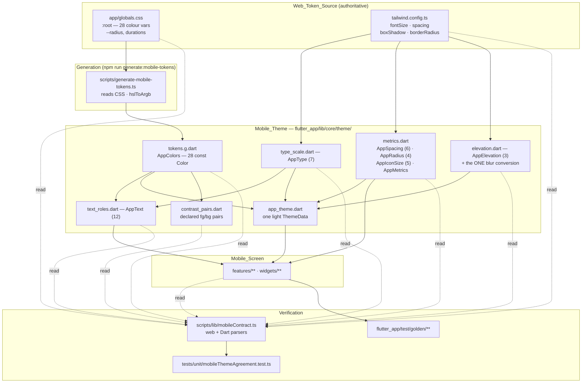

# Design Document

## Overview

This design ports one design language across a language boundary and then pins it,
so the two clients cannot drift again without a red test.

The work divides into four artefacts, and only the first is Dart:

1. **A rebuilt theme layer** under `flutter_app/lib/core/theme/`, whose colour
   constants are **generated** from `app/globals.css` rather than typed.
2. **Web-side and Dart-side parsers** added to `scripts/lib/mobileContract.ts`,
   which already holds this project's cross-language parsers and already refuses to
   return an empty set.
3. **`tests/unit/mobileThemeAgreement.test.ts`**, which compares the two and fails
   naming the token it disagreed about.
4. **A golden suite** under `flutter_app/test/golden/`, for the composition a
   parser cannot see.

### The finding that shapes everything else

The requirements say Flutter "is wearing the previous" palette. Git says it is wearing
the one before that as well, and that three successive documents each claimed to match
the web:

| Source | Palette it declares | Last touched |
| --- | --- | --- |
| `flutter_app/SPEC.md` | Slate + Blue 600, "matching web app" | — |
| `flutter_app/lib/core/theme.dart` | warm gold/parchment, "Matches the web app's CSS variables exactly" | **2026-08-12** |
| `app/globals.css` | violet, hue 275 | **2026-09-02** (`--iris` landed 2026-08-28) |

`theme.dart` has exactly one commit against it. `globals.css` has eight since that
commit, and the gold it claims to match (`41 56% 30%`) was deleted from the web on
2026-08-19 — seven days *after* `theme.dart` was last written. The Flutter palette has
never been checked against the web palette by anything, and it shows.

The design conclusion is not "port the colours". It is that **a prose claim of
agreement is worthless and must be replaced by a test**, which is why the parser and
the generator are load-bearing rather than supporting infrastructure.

### Decisions, and what each one rejects

| Decision | Rejected alternative | Why |
| --- | --- | --- |
| Colour constants are **generated** into `tokens.g.dart` from the CSS | Hand-typed hex literals verified by the test | A hand-typed hex is the drift this spec removes. Generation makes the test a *confirmation*, not the only defence. `npm run generate:dart-vocab` is the existing precedent. |
| The theme is a **directory** (`core/theme/`) behind a barrel at `core/theme.dart` | One 700-line `theme.dart` | Six concerns (colour, type, roles, metrics, elevation, contrast pairs) need six parsers. Splitting them makes each parser's input a file, not a region of a file. The barrel keeps all 46 existing imports working. |
| `tailwind.config.ts` is **imported**, not regex-parsed | Text-parsing it like the CSS | It is a TypeScript module in the same Vitest project. Importing removes the entire class of comment-matching bugs this repo has already been bitten by twice (`identityGate.test.ts`, `tsUnionMembers`). Only the value *strings* (`calc()`, shadow layers) get parsed. |
| `globals.css` **is** text-parsed | Extracting it into TS first | It is CSS consumed by Tailwind; moving it to make a test easier would change the product to suit the harness. |
| Transitional aliases are **marker comments**, not `@Deprecated` | `@Deprecated` as Req 1.5 words it | `@Deprecated` emits a `deprecated_member_use` info at every one of ~460 alias call sites, which breaks Req 14.7's 10-issue ceiling at every intermediate stage. See [Requirement conflicts](#requirement-conflicts-that-need-resolving-before-implementation). |
| Hit area is a **custom `RenderProxyBox`** overriding `hitTest` | `SizedBox(48,48)` or `MaterialTapTargetSize.padded` | Both inflate *layout*, which moves the 54px chrome height Req 4.2 fixes. Overriding `hitTest` inflates only the touch rect, which is what Req 4.4 and Req 13.6 actually ask for. |
| One `ThemeData`, full `ColorScheme` constructor, every slot bound to a token | `ColorScheme.light()` / `ColorScheme.fromSeed` | Req 1.7 fails on any colour in the theme that matches no token. Every unassigned `ColorScheme` slot is a Material default — a purple that is not *our* purple — so a seeded or partial scheme smuggles in ~15 untokenised colours. |

### One divergence from the web, forced by the requirements themselves

The web's phone chrome puts `gap-1.5` (6 logical pixels) between adjacent 40px
controls. Two 40px controls 6px apart sit 46px centre to centre, so their 48px hit
areas **overlap by 2px** — which Req 13.6 forbids outright. The Flutter chrome
therefore uses `snug` (8px), putting centres exactly 48px apart so the hit areas touch
without intersecting.

This changes nothing Req 4.2 measures: the gap is horizontal and the strip's height is
still inset + 54. Recorded here rather than left to be discovered, because a reviewer
comparing screenshots will see a 2px difference and should know it is deliberate.

---

## Open questions, resolved

### Q1 — Is the warm palette deliberate or stale? **Stale. Closed.**

Evidence, in descending order of strength:

- **Chronology.** `theme.dart`'s only commit is 2026-08-12. The gold it names
  (`41 56% 30%`) was removed from `globals.css` on 2026-08-19 and the violet
  (`--iris`) landed 2026-08-28. A deliberate divergence cannot predate the thing it
  diverges from.
- **The file states the opposite of divergence.** Its header says "Matches the web
  app's CSS variables exactly" and every constant carries the web HSL it was copied
  from in a trailing comment (`// hsl(41, 52%, 48%) — primary CTA`). A deliberate
  second palette does not document itself as a copy of the first.
- **A third, older palette says the same thing.** `flutter_app/SPEC.md` §Design
  System declares a Slate/Blue-600 palette headed "matching web app". So the Flutter
  client has now claimed agreement with the web three times, with three different
  palettes, and been wrong at least twice.
- **Nothing reads the warm identifiers for their warmth.** `AppTheme.gold` has 14 call
  sites and every one is a primary action or a price; `parchment` has 2, both surfaces.
  They are used as *roles*, not as hues.

Requirement 1 stands. No design work is needed to accommodate a deliberate warm palette,
because there is not one.

### Q2 — Does the Hugeicons free Flutter tier cover the web's glyphs? **ANSWERED 2026-09-06: no. 53 of 104 missing (51.0%). Req 12.9 has fired; icon parity is dropped and Material icons stay.**

> **The rest of this section is the pre-measurement analysis and its prediction was
> wrong.** It is kept because the reasoning is what the measurement corrected. The
> measured figures, the 53 names, and the reasons the two free tiers differ are in the
> decision record under Requirement 12 criterion 9 in `requirements.md`. In short: the
> styles match but the *name sets* do not — the JS free package ships Lucide-compatible
> aliases the Dart package does not, the Dart free tier is 5,159 members against 6,025,
> and the assumed `HugeIconsStrokeRounded.arrowLeft01` transform does not exist (the real
> accessor is `HugeIcons.strokeRoundedArrowLeft01`, over SVG path data rather than
> `IconData`).

What is measured:

- The web imports **104 distinct glyph names** from `@hugeicons/core-free-icons` across
  146 files (the requirement says 142; the count has grown).
- That package (v4.3.0, in `node_modules`) exports **6,025** icons. All **104 of 104**
  web names are present. **Web-side shortfall: 0.**

What is *not* measured, and why: the Dart glyph set lives in the `hugeicons` pub
package, which is not a dependency of `flutter_app/pubspec.yaml` and is not in the tree.
I cannot enumerate `HugeIconsStrokeRounded`'s members without `flutter pub add hugeicons
&& flutter pub get`. **I am not guessing a figure for it.**

What the evidence supports, short of that measurement: both free tiers are the same
*set* — the stroke-rounded style. Hugeicons' own Flutter integration page describes the
free package as "6,000+ icons, stroke-rounded style", against the JS package's 6,025
exports ([Hugeicons Flutter integration
docs](https://docs.hugeicons.com/integrations/flutter); content rephrased for
compliance with licensing restrictions). A shortfall above Req 12.9's 10 percent
threshold — 11 or more of 104 glyphs missing — would mean the two free tiers are not the
same set, which nothing suggests.

The name transform is mechanical, which is what makes the measurement cheap once the
package is installed: strip the trailing `Icon`, lower the first character.
`ArrowLeft01Icon` → `HugeIconsStrokeRounded.arrowLeft01`; `TriangleAlertIcon` →
`triangleAlert`.

**Task, not a design assumption.** Task 1 of the icon stage is: add the package, emit
the 104 transformed names, compile a file referencing each, and record the count that
fails to resolve. If it is 11 or more, Req 12.9 fires and the icon stage is replaced by
a recorded decision to keep Material icons. Everything else in this design is
independent of the outcome, because `icons.dart` is the only module that names a glyph
either way.

### Q3 — How many screens should the golden suite cover? **Recommendation: keep the full set, but pair only where the pair can differ.**

Req 13.13 doubles every golden with a 2.0 text-scale twin, which is where the ~40 files
come from. The recommendation is to keep every state the requirements name and cut the
pairing rule instead: capture the 2.0 twin only for goldens whose content includes
reflowable text or a control label — which excludes, for example, the "no cover image"
listing card and the shell-with-no-destination-current. That removes roughly a third of
the images while losing no coverage that could have differed.

**Marked as a recommendation.** It narrows Req 13.13 as written, so it needs sign-off.

### Q4 — Should the retired-token aliases exist? **Recommendation: yes, but they cannot be `@Deprecated`, and they do not help where the pain actually is.**

The aliases are worth keeping — a single atomic diff here would be roughly 460 spacing
references, 179 icon references and 144 colour references in one change, which is not
reviewable. But two things about them are wrong as specified:

1. `@Deprecated` breaks the analyzer ceiling (Req 14.7). Use a marker comment and let
   the test carry the ratchet, which Req 1.6 already assigns to the test anyway.
2. **Aliases cannot cover the dangerous half of the migration.** Four identifiers
   survive the port with a *different meaning*:

   | Identifier | Means today | Means after the port | Call sites |
   | --- | --- | --- | --- |
   | `primary` | near-black ink `#151210` | violet fill `275 38% 44%` | 15 |
   | `secondary` | muted brown text `#6B5E52` | pale surface tint `275 20% 95%` | 36 |
   | `muted` | light grey text `#9C9080` | surface tint `275 20% 95%` | 58 |
   | `accent` | gold, i.e. the CTA colour | pale violet tint `278 46% 92%` | 35 |

   A `@Deprecated` alias says "this name is going away". These names are not going
   away; they are being repurposed, and every one flips from ink to fill or fill to
   tint. 144 call sites would keep compiling and render wrong. **They must be rewritten
   in the same change as the theme**, which is why Stage 1 below is larger than "swap
   the constants".

### Q5 — Which host platform for the goldens? **Recommendation: Windows, named in one constant.**

Windows is where the toolchain is (`C:\Users\Phil\flutter\bin\flutter.bat` is on PATH)
and CI does not exist yet. Req 15.10 makes the suite *skip* its pixel comparison on any
other host, so designating a platform nobody has turns the whole suite into a skip —
which is this repo's own stated worst case, one step past a vacuous pass.

Linux is the better long-run answer: it is the cheaper and more available CI host, and
`vercel.json` already puts the project's automation on Linux. The cost of switching
later is one constant plus one regeneration commit, and the cost of choosing it now is
that the comparison never runs.

So: `GoldenHost.designated = TargetPlatform.windows` in
`test/golden/_harness/golden_harness.dart`, one reference to it, and a comment naming
Linux as the intended successor and the switch as a regeneration.

**Marked as a recommendation.** It is a call about CI, which is not mine to make.

---

## Architecture

### Where a value comes from



Two things the diagram is making explicit:

- **Generation and verification are separate paths.** The generator writes
  `tokens.g.dart`; the test re-derives the expected value from the CSS and compares.
  They share `hslToArgb`, so a bug *inside* that function would satisfy both — which is
  exactly why P1 exists as an independent round-trip property and why the test also
  carries a fixed vector table (see [Correctness Properties](#correctness-properties)).
- **`type_scale.dart`, `metrics.dart` and `elevation.dart` are hand-written**, not
  generated. Their inputs are seven, six and three entries; a generator for eighteen
  numbers is more machinery than the numbers deserve, and the parser catches a typo
  immediately. Colour is generated because it is 28 values through a non-trivial
  conversion, where a typo is invisible on inspection.

### Layering, and what this design may not touch

`domain/` ← `lib/` ← `components/` ← `app/` on the web; the Flutter mirror is
`domain/` ← `services/`+`providers/` ← `features/`+`widgets/`. This design lives
entirely in the presentation tier:

- **Reads** `flutter_app/lib/domain/**` and `core/money.dart`. Adds nothing to them
  (Req 14.11), and adds no ninth module (Req 14.1).
- **Adds no** RPC, contract-table write, or mobile route handler (Req 14.3).
- **Adds no** conditional deciding eligibility, permission, money or contract state
  (Req 14.12). Every branch this design introduces switches on a value the screen
  already has.
- `core/money.dart` stays the only money formatter (Req 14.5). `price_display.dart`
  gets restyled; it does not get a second `toStringAsFixed`.

`scripts/lib/mobileContract.ts` and `tests/unit/**` are web-side and already exist for
this purpose, so nothing new appears at the top level of the repo.

### The blur convention, stated once

CSS `box-shadow`'s third length is a blur *diameter*: the spec defines it as twice the
Gaussian standard deviation. Flutter's `BoxShadow.blurRadius` is neither — it is
converted by `Shadow.convertRadiusToSigma`, which the installed SDK
(`bin/cache/pkg/sky_engine/lib/ui/painting.dart:8730`) defines as:

```dart
static double convertRadiusToSigma(double radius) {
  return radius > 0 ? radius * 0.57735 + 0.5 : 0;
}
```

`0.57735` is 1/√3. Equating the two gives the conversion:

```
flutterBlurRadius(cssBlur) = (cssBlur / 2 - 0.5) * sqrt(3),  clamped at 0
```

| Web layer | CSS blur | Flutter `blurRadius` |
| --- | --- | --- |
| `market` layer 1 | 2 | 0.866 |
| `lift` layer 1 | 6 | 4.330 |
| `market` layer 2 | 10 | 7.794 |
| `lift` layer 2 | 14 | 11.258 |
| `auction` | 16 | 12.990 |

**Where it lives:** `AppElevation.blurFromCss(double cssBlur)` in
`flutter_app/lib/core/theme/elevation.dart`, and nowhere else (Req 3.11). Every
`AppElevation` entry states the *CSS* number and passes it through that function; the
parser reads the CSS numbers and compares them to the web's directly, so the conversion
is never part of the comparison. Req 3.11's "fail naming any second conversion" is
implemented as: the parser fails on any occurrence of `0.57735`, `sqrt(3)` or
`1.7320` under `flutter_app/lib/` outside that one function.

Note that this is why Req 3.9's bound reads cleanly: the largest web blur is 16 in CSS
terms, and the bound is checked in CSS terms, so the ghost-card guard is unaffected by
the conversion.

---

## Components and Interfaces

### 1. Mobile_Theme

```
flutter_app/lib/core/theme.dart          ← unchanged path: a one-line barrel
flutter_app/lib/core/theme/
  theme.dart              exports everything below
  tokens.g.dart           GENERATED. AppColors — 28 const Color, declared once
  type_scale.dart         AppType — 7 levels + the tracking rule
  text_roles.dart         AppText — 12 Semantic_Text_Roles
  metrics.dart            AppSpacing (6) · AppRadius (4) · AppIconSize (5) · AppMetrics
  elevation.dart          AppElevation (3) + blurFromCss — the ONE blur conversion
  tints.dart              AppTint — semantic washes as token + explicit alpha
  contrast_pairs.dart     AppContrastPairs — declared pairs + the exception list
  app_theme.dart          AppTheme — the single light ThemeData
  migration_aliases.dart  transitional aliases on AppTheme; deleted at the end
```

`flutter_app/lib/core/theme.dart` survives as `export 'theme/theme.dart';`, so all 46
files that `import 'package:cardtrade/core/theme.dart'` are untouched by the split.

**Glossary correction.** The requirements define Mobile_Theme as "the `AppTheme` class
in `flutter_app/lib/core/theme.dart`". Dart cannot split a class across files, and one
class holding 28 colours, 7 levels, 12 roles, 6 steps, 4 radii, 3 elevations and a
`ThemeData` is not reviewable. Read Mobile_Theme as **the theme layer** — the directory
above. The parsers read the directory, so nothing escapes the check by moving between
its files.

#### `AppColors` (generated)

28 `static const Color`, one per Req 1.1 variable, named by the lowerCamelCase rule.
Worked examples, so the generator's output is checkable by hand:

| Variable | Resolved HSL | Emitted |
| --- | --- | --- |
| `--background` | `0 0% 100%` | `Color(0xFFFFFFFF)` |
| `--primary` | `275 38% 44%` | `Color(0xFF77469B)` |
| `--iris-ink` | `275 34% 51%` | `Color(0xFF8958AD)` |
| `--action` | `40 96% 68%` | `Color(0xFFFCC85F)` |
| `--trust` | `173 80% 26%` | `Color(0xFF0D776B)` |
| `--ring` | `var(--iris)` → `275 34% 58%` | `Color(0xFF9A6FB8)` |

**This design deliberately does not carry the other 22.** A fourth copy of the palette,
in a document nothing parses, is precisely the artefact this spec exists to delete. The
generator holds the transform; `tokens.g.dart` holds the values; the test holds the
comparison.

Four variables resolve through `var()` and are the reason Req 15.5 exists:
`--card-foreground` → `--foreground`, `--popover-foreground` → `--foreground`,
`--ring` → `--iris`, `--action-foreground` → `--obsidian`.

Four `:root` declarations are **not** colours and are classified out of scope by the
parser rather than skipped: `--radius`, `--duration-exit`, `--duration-enter`,
`--duration-move`. `--radius` is read separately by the radius parser.

#### `AppType` — seven levels

Size in logical pixels, `height` as the CSS multiplier carried across unchanged
(Req 2.2), letter-spacing from the one rule, **no weight and no colour** (Req 2.4):

| Level | rem | px | `height` | `letterSpacing` |
| --- | --- | --- | --- | --- |
| `meta` | 0.75 | 12 | 1.4 | −0.12 |
| `body` | 0.8125 | 13 | 1.6 | −0.13 |
| `nav` | 0.9375 | 15 | 1.4 | −0.15 |
| `lead` | 1 | 16 | 1.5 | −0.16 |
| `subhead` | 1.0625 | 17 | 1.4 | −0.17 |
| `head` | 1.3125 | 21 | 1.25 | −0.21 |
| `display` | 1.75 | 28 | 1.1 | −0.28 |

```dart
/// The root tracking `app/globals.css` states as `-0.01em`, in logical pixels.
/// Req 2.16. This is the only place the ratio appears.
static double tracking(double sizePx) => -0.01 * sizePx;
```

`nav` is declared so the token sets agree in both directions, and the parser fails on
any Mobile_Screen reference to it (Req 2.12), because every web `text-nav` sits behind
`md:` and never renders at phone width.

`body` becomes the tree default via `ThemeData.textTheme.bodyMedium` plus a root
`DefaultTextStyle` in the shell (Req 2.11). Field, text-area and select text take
`lead` and are **not** stepped down (Req 2.15) — the web's `pointer-fine:` step-down
gates on a precise pointer, which a phone does not have.

#### `AppText` — twelve Semantic_Text_Roles

Each role is exactly one level plus a weight plus a token (Req 2.5). The twelve
identifiers already exist in `theme.dart` and are already used at 93 call sites, so the
role *names* survive the port and only their values move — which is why the roles are
the cheapest part of this migration and the reason to keep them rather than start over.

| Role | Level | Weight | Colour | Note |
| --- | --- | --- | --- | --- |
| `priceHero` | `display` | 700 | `irisInk` | Req 6.2. Nothing else on that screen may exceed it. |
| `priceCard` | `head` | 700 | `irisInk` | Req 5.3's major-unit part |
| `priceInline` | `body` | 700 | `irisInk` | Req 5.3's symbol and minor-unit parts |
| `cardTitle` | `body` | 500 | `foreground` | clamped to 2 lines by the caller |
| `rowName` | `body` | 600 | `foreground` | |
| `bodyText` | `body` | 400 | `foreground` | |
| `supportText` | `body` | 400 | `mutedForeground` | Subtext_Rule: colour, not size |
| `metaText` | `meta` | 400 | `mutedForeground` | chrome only |
| `badgeText` | `meta` | 600 | set by the badge | |
| `sectionLabel` | `meta` | 600 | `mutedForeground` | **the one tracking override** |
| `detailLabel` | `body` | 400 | `mutedForeground` | |
| `detailValue` | `body` | 500 | `foreground` | |

Two consequences worth stating because they look like mistakes:

- **`supportText` and `detailLabel` move up from 11px to 13px** and stop being smaller
  than the text they support. That is the Subtext_Rule (Req 2.13) doing its job; the
  de-emphasis is now entirely `mutedForeground`.
- **`sectionLabel` is the only role permitted its own tracking** (Req 2.16's exception),
  at `+0.12 × size`, because `.cardtrade-eyebrow` / `.market-label` in `globals.css`
  give it `tracking-[0.12em]` as a treatment of its own.
- **`badgeText` moves 10px → 12px.** `meta` is floored at 12px on the web for a stated
  reason and there is no eighth level to drop to.

Prices use `fontFeatures: [FontFeature.tabularFigures(), FontFeature.liningFigures()]`
(Req 5.4, 7.4, 12.7) — the font-feature route, on the single family, matching
`.display-value`. Never a second family.

#### `AppTint` — semantic washes

Req 1.8 wants every wash to be a token at an explicit alpha matching the web's. This is
where the `*Light` constants in today's theme go; they are not colours, they are
compositions, and the web states them as rules in `globals.css`:

| Tint | Web rule | Composition |
| --- | --- | --- |
| `caution` | `.cardtrade-warning` | fill `action` @ 0.22, edge `actionBorder` @ 0.5, ink `foreground` |
| `successChip` | `.cardtrade-success-chip` | fill `trust` @ 0.12, edge `trust` @ 0.4, ink `trust` |
| `successFill` | `.cardtrade-success-fill` | fill `trust` @ 0.5 |
| `eyebrow` | `.cardtrade-eyebrow` | fill `iris` @ 0.08, edge `iris` @ 0.4, ink `irisInk` |
| `selection` | `::selection` | `iris` @ 0.3 |
| `skeleton` | `bg-muted/70` | `muted` @ 0.70 |
| `coverScrim` | Req 5.11 | `obsidian` @ 0.45 |
| `binderMarker` | Req 5.7 | `obsidian` @ 0.75, ink `mist` |
| `pressOverlay` | `hover:bg-foreground/5` | `foreground` @ 0.05 |

Each is `Color.withValues(alpha:)` on an `AppColors` member. `coverScrim` and
`binderMarker` have no `globals.css` counterpart because the web's phone tile expresses
them in Tailwind arbitrary values rather than a component rule; the parser accepts a
tint whose alpha is declared in the requirements and fails on any other (Req 1.8).

#### `AppSpacing`, `AppRadius`, `AppIconSize`, `AppMetrics`

```dart
abstract final class AppSpacing {   // Req 3.1 — six steps, no seventh
  static const tight = 4.0;    static const snug = 8.0;
  static const cozy = 12.0;    static const group = 16.0;
  static const section = 32.0; static const region = 64.0;
}

abstract final class AppRadius {    // Req 3.6 — derived from --radius = 8
  static const _base = 8.0;                  // 0.5rem
  static const sm = _base - 4;               // 4
  static const md = _base - 2;               // 6
  static const lg = _base;                   // 8
  static const full = 999.0;                 // Req 3.7 — the one with no counterpart
}

abstract final class AppIconSize {  // Req 12.8 — the web's size-3 … size-6
  static const micro = 12.0;   static const button = 14.0;
  static const base = 16.0;    static const large = 20.0;
  static const display = 24.0;
  static const strokeWidth = 1.75;           // Req 12.1 — declared once
}
```

`AppRadius.xl` (14) is **deleted, not aliased**: Req 3.7 names it as the surplus radius
to remove, and it has zero call sites today.

`AppMetrics` holds the figures Req 3.5 exempts from the spacing check, so the exemption
is keyed to named constants rather than to a list of magic numbers:

| Constant | Value | Source |
| --- | --- | --- |
| `minHitArea` | 48.0 | Req 13.6 |
| `controlHeight` | 40.0 | Req 8.7 — the web's largest variant at phone width |
| `chromeRow` | 40.0 | `MobileChromeFrame`'s `min-h-10` |
| `chromeContent` | 54.0 | Req 4.2 — inset + 54 |
| `navBar` | 56.0 | Req 4.8 — inset added *below* it |
| `watchControl` | 32.0 | Req 5.5 |
| `attachmentThumb` | 224.0 | Req 9.5 |
| `bubbleMaxWidthFraction` | 0.82 | Req 9.3 |
| `hairline` | 1.0 | Req 3.10 — one logical pixel, never fractional |

The current theme's `0.5`-width borders all become `hairline`. Req 3.10 is explicit that
a card is bounded by its edge and not by its shadow, and a 0.5px border on a 3× device
is a sub-pixel line that disappears at some densities.

#### `AppElevation`

Three entries, each an ordered `List<BoxShadow>` with one entry per web layer, in web
paint order, drawn in `AppColors.obsidian`, zero spread (Req 3.8, 3.12):

| Entry | Layers | CSS blurs | Alphas |
| --- | --- | --- | --- |
| `market` | 2 | 2, 10 | 0.04, 0.05 |
| `auction` | 1 | 16 | 0.10 |
| `lift` | 2 | 6, 14 | 0.07, 0.10 |

`shadowSm` / `shadowMd` / `shadowLg` are gone. `shadowLg` (44px blur) has zero call
sites; `shadowSm` and `shadowMd` have 2 and 1 and become `market` — the 30px and 44px
blurs are the ghost-card tell `globals.css` removed by name, and Req 3.9 makes their
return a failure.

#### `AppContrastPairs` — and how Req 13.3 is actually made tractable

Req 13.3 asks the test to measure "each colour a Mobile_Screen applies to text… against
the surface token of its nearest enclosing container". Inferring an enclosing surface
from Dart source needs a layout engine, and Req 13.4 forbids quietly measuring less than
was read. Rather than build an inference engine or weaken the requirement, the design
**moves the pairing into source as a declaration**:

```dart
/// Every foreground/background combination the product actually draws.
/// A pair listed here is measured by the Token_Agreement_Test against the floor
/// its type level earns. Req 13.1, 13.2, 13.3.
const declaredPairs = <ContrastPair>[
  ContrastPair(fg: 'foreground',      bg: 'background', level: 'body'),
  ContrastPair(fg: 'mutedForeground', bg: 'background', level: 'body'),
  ContrastPair(fg: 'mutedForeground', bg: 'muted',      level: 'body'),
  ContrastPair(fg: 'mist',            bg: 'obsidian',   level: 'meta'),
  ContrastPair(fg: 'input',           bg: 'background', role: PairRole.controlEdge),
  // …
];
```

The rule that makes this complete rather than a subset: **a Mobile_Screen may not name
a colour for text.** It names a Semantic_Text_Role, or a pair from this list. The parser
enforces it — any `color:` argument on a text-bearing widget that is not an `AppText`
role or a `declaredPairs` member fails naming the file and line. So "every colour a
Mobile_Screen applies to text" and "every declared pair" become the same set, and
Req 13.4's cannot-measure-nothing clause has something finite to check.

**The exception list ships empty, and that is the measured result, not an omission.**
Every pair the current tokens produce clears its floor:

| Pair | Ratio | Floor | |
| --- | --- | --- | --- |
| `foreground` on `background` | 16.83 | 4.5 | ✓ |
| `foreground` on `muted` | 14.91 | 4.5 | ✓ |
| `mist` on `obsidian` | 16.00 | 4.5 | ✓ |
| `secondaryForeground` on `secondary` | 9.47 | 4.5 | ✓ |
| `obsidian` on `action` | 12.28 | 4.5 | ✓ |
| white on `primary` | 6.70 | 4.5 | ✓ |
| white on `destructive` | 6.67 | 4.5 | ✓ |
| `mutedForeground` on `background` | 5.70 | 4.5 | ✓ |
| `trust` on `background` | 5.43 | 4.5 | ✓ |
| `accentForeground` on `accent` | 5.32 | 4.5 | ✓ |
| `irisInk` on `background` | 5.17 | 4.5 | ✓ |
| `mutedForeground` on `sidebar` | 5.16 | 4.5 | ✓ |
| `mutedForeground` on `muted` | 5.04 | 4.5 | ✓ |
| `irisInk` on `muted` | 4.58 | 4.5 | ✓ |
| `input` on `background` (control edge) | 3.30 | 3.0 | ✓ |
| `actionBorder` on `background` (control edge) | 3.09 | 3.0 | ✓ |
| `iris` on `background` (marker, non-text) | 3.93 | 3.0 | ✓ |
| `border` on `background` (hairline) | 1.47 | — | out of scope per Req 13.2 |

Req 13.5's second clause — fail on a recorded pair that now passes — means the empty
list is self-maintaining: nobody can leave a stale entry behind.

**One incidental finding.** Four of these ratios disagree with the figures written in
`globals.css`'s comments: the comments say `--iris-ink` is 4.94:1 "on page", `--trust`
5.26:1, `--iris` 3.73:1, `--accent-foreground` 5.49:1. Those were measured against the
98%-lightness page that was later reverted to white, so they understate the current
values (the comment's own "on card 5.19:1" for `--iris-ink` matches my 5.17). The test
therefore **measures** and never reads a ratio out of a comment.

#### `AppTheme` — one `ThemeData`

`ThemeData(brightness: Brightness.light, colorScheme: ColorScheme(…))` with **every**
`ColorScheme` slot bound to an `AppColors` member. No `ColorScheme.light()`, no
`fromSeed`: Req 1.7 fails on any colour in the theme matching no token, and an
unassigned slot is a Material default.

The mapping, where it is not a direct name match: `surface` → `card`, `onSurface` →
`cardForeground`, `surfaceContainerHighest` → `muted`, `onSurfaceVariant` →
`mutedForeground`, `outline` → `border`, `outlineVariant` → `border`, `tertiary` →
`trust`, `onTertiary` → `background`, `inverseSurface` → `obsidian`,
`onInverseSurface` → `mist`, `scrim` → `obsidian`, `shadow` → `obsidian`.

`MaterialApp` gets `themeMode: ThemeMode.light` and no `darkTheme` (Req 1.9). Dark
regions — the equivalent of the web's `.auction-stage` and `.ledger-strip` — are a
widget, not a theme:

```dart
/// A region drawn on `obsidian` with `mist` ink. Req 1.9: dark surfaces are built
/// from two tokens, not from a second ThemeData and never from the OS setting.
class ObsidianRegion extends StatelessWidget { … }
```

#### `TapTarget` — the 40/48 separation

`flutter_app/lib/widgets/common/tap_target.dart`. A `SingleChildRenderObjectWidget`
whose `RenderTapTarget extends RenderProxyBox` overrides `hitTest` to accept a position
inside the child's rect inflated to at least `AppMetrics.minHitArea` about its centre,
and leaves `performLayout` delegating to the child untouched.

Rejected: `SizedBox(width: 48, height: 48)` and `MaterialTapTargetSize.padded`. Both
inflate **layout**, which pushes the chrome row past `min-h-10` and moves the inset + 54
height Req 4.2 fixes to within 1 logical pixel. Overriding `hitTest` inflates only the
touch rect, which is what Req 4.4, 5.5, 8.7 and 13.6 each ask for in the same words.

`RenderTapTarget` exposes its inflated rect so the Flutter-side intersection test
(Req 13.6) can assert that no two overlap — see [Testing Strategy](#testing-strategy).

#### `Icon_Map` — `flutter_app/lib/core/icons.dart`

The only module naming a glyph (Req 12.2). One entry per icon:

```dart
/// Web `PackageOpenIcon` → nearest free-tier stroke-rounded equivalent.
/// Reason: the free tier ships `packageOpen` under `parcel`; same silhouette.
const parcelOpen = IconEntry(
  web: 'PackageOpenIcon',
  flutter: HugeIconsStrokeRounded.parcel,          // differs → reason required
  reason: 'free tier names the open-parcel glyph `parcel`',
);
```

`IconEntry.reason` is required only where `flutter` differs from the mechanical
transform of `web`; the parser derives the expected Dart name (strip `Icon`, lower the
first character) and fails on a mismatch without a reason (Req 12.2). One
platform-exception entry is permitted, for the platform back chevron (Req 12.4).

#### Fonts

`assets/fonts/` exists and is empty. Add the four weights the web uses — 400, 500, 600,
700 — as `PlusJakartaSans-{Regular,Medium,SemiBold,Bold}.ttf`, declare them in
`pubspec.yaml` under one `fontFamily: 'Plus Jakarta Sans'`, and **remove the
`google_fonts` dependency** (Req 12.5: no runtime fetch; also a hard prerequisite for
deterministic goldens, since a network font makes the first frame nondeterministic).

`lucide_icons` is removed (Req 12.3 — zero Dart references). `shimmer` is removed too:
it sweeps a gradient, and Req 11.2 specifies an *opacity* pulse between 1.0 and 0.5 on a
2000 ms loop, which is what `bg-muted/70 animate-pulse` does on the web.

No monospace family is declared (Req 12.6). Req 12.10's guard is the parser failing on
any `FontWeight.w{100,200,300,800,900}` under `flutter_app/lib/`.

### 2. Mobile_Contract_Parser additions

All additions go in `scripts/lib/mobileContract.ts`, whose header already states the
strictness contract: report what could not be understood rather than returning an empty
set. Existing helpers reused: `walkDart`, `braceBlock`, `lineOf`, `readFlutter`.

Every parser below returns `{ identifier | token, value, line }` per Req 15.1 and
throws — never skips, never partially returns — per Req 15.2 and 15.4.

#### Web side

```ts
/** `:root` colour variables from app/globals.css, `var()` chains resolved. */
export function webColorTokens(): WebColorToken[];

/** Every `:root` declaration classified, so criterion-3 scoping is auditable. */
export function webRootDeclarations(): WebRootDeclaration[];

/** fontSize / spacing / borderRadius / boxShadow, read by IMPORTING the config. */
export function webFontSizeLevels(): WebTypeLevel[];
export function webSpacingSteps(): WebLength[];
export function webRadiusValues(): WebLength[];
export function webShadowTokens(): WebShadowToken[];
```

`webColorTokens` is text-parsing, in this order — the order matters:

1. **Strip `/* … */` comments first.** `globals.css` comments contain `--primary`,
   `--input`, ratio prose and retired HSL values. This project has been bitten twice by
   pattern-matching prose (`identityGate.test.ts` parses migration text; `tsUnionMembers`
   lost five members to a semicolon in a comment), and this file is worse than either.
2. **Scope to the `:root { … }` block** by brace balance, not by regex. Throw if `:root`
   is absent or its block is empty (Req 15.4).
3. **Ignore any `.dark` block entirely** (Req 1.10). There is none today; the branch
   exists so that adding one cannot silently change what is compared.
4. **Classify** each declaration: literal HSL triple / `var()` reference / length /
   duration / unrecognised. Unrecognised throws.
5. **Resolve `var()`** to a literal triple.

Alias resolution, which P13 covers:

```ts
function resolveVar(token: string, decls: Map<string, string>, seen = new Set<string>()): string {
  if (seen.has(token)) throw new Error(`circular var() chain: ${[...seen, token].join(' → ')}`);
  // …depth cap 16; throw naming the token if the chain ends in a non-triple
}
```

`webFontSizeLevels` and friends **import** `tailwind.config.ts` rather than reading it as
text:

```ts
import tailwindConfig from '@/tailwind.config';
const extend = tailwindConfig.theme?.extend;
if (!extend?.fontSize) throw new Error('tailwind.config.ts has no theme.extend.fontSize block');
```

That is what "read the `fontSize` block" means most robustly (Req 15.3), and it removes
the comment hazard entirely for this file — the config's comments say things like
"0 4px 10px at 5%" and "`body` is 0.8125rem (13px)", every one of which a regex would
happily match. Only the *value strings* are parsed: `rem` → ×16, and `calc()`.

```ts
/**
 * A Web_Token_Source length in logical pixels. Req 15.6.
 * Handles: `0.5rem`, `8px`, `calc(var(--radius) - 2px)`.
 * Throws on any other shape rather than guessing.
 */
function toLogicalPixels(raw: string, vars: Map<string, string>): number;
```

`webShadowTokens` splits layers on commas **at paren depth zero** (Req 15.7), so
`market` and `lift` yield two layers each and `auction` one. A naive `split(',')` is
correct for today's values and wrong the moment anyone writes `rgba(0,0,0,.05)`; the
depth-aware split costs four lines. Each layer parses to
`{ dx, dy, blur, spread: 0, alpha, colorToken }` with `blur` in the **CSS** convention.

#### Dart side

```ts
export function dartColorConstants(): DartColorConst[];   // AppColors + any Color( in the theme dir
export function dartTypeLevels(): DartTypeLevel[];        // AppType
export function dartTextRoles(): DartTextRole[];          // AppText
export function dartSpacingSteps(): DartNumeric[];        // AppSpacing
export function dartRadiusValues(): DartNumeric[];        // AppRadius
export function dartIconSizes(): DartNumeric[];           // AppIconSize
export function dartElevations(): DartShadow[];           // AppElevation, blurs in CSS convention
export function dartTints(): DartTint[];                  // AppTint
export function dartContrastPairs(): DartContrastPair[];  // AppContrastPairs
export function dartColorSchemeSlots(): DartSchemeSlot[]; // every ColorScheme argument
export function dartMigrationAliases(fixture?: string): DartAlias[]; // identifier → replacement + ref count
// Empty is the FINISHED state once Stage 9 deletes the last alias, so this is the one
// parser with no "read nothing" guard; `fixture` lets P12 prove the reader still reads.
```

Each locates its class by `abstract final class <Name> {` and reads the body with the
existing `braceBlock`. Each throws when the class is absent, when the body yields zero
entries, or when a member cannot be reduced — including the case that matters most:
`dartTypeLevels` throws on a level whose size is an expression it cannot evaluate,
rather than recording `null` and letting the comparison pass.

#### Call-site scanners

```ts
export type LiteralKind =
  | 'fontSize' | 'spacing' | 'iconSize' | 'strokeWidth' | 'shadowBlur'
  | 'colorLiteral' | 'materialIcon' | 'fontWeight' | 'currencySymbol'
  | 'minorUnitDivisor' | 'glyphName' | 'navLevel' | 'textColor';

export function dartCallSiteLiterals(kinds: LiteralKind[]): DartLiteralHit[];
```

Scoped to `flutter_app/lib/features/**` and `flutter_app/lib/widgets/**`, with comments
and string literals removed before matching. The discriminations Req 2.9 and Req 3.5
demand are properties of this function:

- `fontSize` matches **only** a `fontSize:` named argument bound to a numeric literal.
  `size:`, `iconSize:`, `strokeWidth:`, `width:`, `height:`, `radius:`, `blurRadius:`,
  `letterSpacing:`, `elevation:` and a *read* of `.fontSize` are all excluded (Req 2.9).
- `spacing` matches a numeric literal in `EdgeInsets.*`, `SizedBox(width:/height:)`,
  `Padding`, `Gap`, `spacing:`, `runSpacing:`, `Positioned` insets. It excludes a
  literal that is an `AppMetrics` value, a border or divider width, an aspect ratio, a
  duration, an opacity, a font size or line height (Req 3.5).
- `colorLiteral` matches `Color(0x…)`, `Colors.<name>` and `Color.from*`, allowing
  `Colors.transparent` alone (P7).
- `textColor` matches a `color:`/`style:` colour on a text-bearing widget that resolves
  to neither an `AppText` role nor a `declaredPairs` member — the mechanism that makes
  Req 13.3 finite.

Current counts, so the ratchet has a starting point (measured across 46 files):

| Kind | Count today |
| --- | --- |
| `Color(0x…)` literals | 12 |
| `Colors.white` | 44 |
| `Colors.black` | 8 |
| `Colors.transparent` (allowed) | 2 |
| `Icons.` references | 179 |
| `fontSize:` numeric literals | 12 |
| `BoxShadow(` at call sites | 2 |
| `EdgeInsets.` call sites | 131 |
| `SizedBox(` call sites | 347 |

#### Comparison functions

```ts
export function hslToArgb(hsl: [number, number, number]): number;
export function argbToHsl(argb: number): [number, number, number];
export function relativeLuminance(argb: number): number;
export function contrastRatio(a: number, b: number): number;

export function comparePalette(web, dart): TokenFinding[];
export function compareTypeScale(web, dart): TokenFinding[];
export function compareSpacing(web, dart): TokenFinding[];
export function compareRadius(web, radiusBase, dart): TokenFinding[];
export function compareElevation(web, dart): TokenFinding[];
export function resolveRoleLevels(levels, roles): TokenFinding[];
```

Every comparison is **bidirectional** and returns findings rather than throwing, so one
run reports every disagreement instead of the first (P4). A `TokenFinding` names the
token, both values, both source lines and the criterion it fails.

`compareRadius` takes `--radius` as an argument and derives 4/6/8 from it rather than
holding them (Req 3.6), so changing `--radius` fails loudly instead of passing.

### 3. Token_Agreement_Test — `tests/unit/mobileThemeAgreement.test.ts`

Runs in the existing Vitest `domain` project: Node, no browser, no Flutter toolchain
(Req 15.8). Structure:

```
describe('the parsers are not lying')          ← Req 15.9, 15.2, 15.4, P12
  · one positive case per parser over a fixture beside the test
  · one negative case per parser: malformed fixture ⇒ throws
  · every parser returns a non-empty set from the LIVE sources
describe('Colour_Conversion')                   ← P1, P2
  · fixed vector table (CSS-spec HSL examples, independent of our code)
  · round-trip property, 100+ runs
  · contrast symmetry / bounds property, 100+ runs
  · alias-chain termination property                             ← P13
describe('the palette agrees')                  ← Req 1.1–1.4, 1.7, 1.8, 1.10, P4
describe('the type scale agrees')               ← Req 2.1–2.7, P5
describe('spacing, radius and elevation agree') ← Req 3.1–3.2, 3.6–3.9, 3.12, P8
describe('no screen hard-codes a value')        ← Req 2.8, 3.5, 3.13, 12.4, 12.8, P6, P7
describe('contrast floors hold')                ← Req 13.1–13.5
describe('the icon map is complete')            ← Req 12.2, P10
describe('every applied weight is bundled')     ← Req 12.10, P11
describe('the migration ratchet only tightens') ← Req 1.6, 1.11, 3.3
describe('the scope boundary holds')            ← Req 14.1, 14.4, 14.5, 14.11, P9
```

Fixtures live at `tests/unit/fixtures/mobileTheme/` — a valid and a malformed sample of
each source shape. They are the *only* place the test asserts a literal token value; the
live assertions always compare two sources to each other.

**The vector table earns its place.** The generator and the test share `hslToArgb`, so a
bug inside that function satisfies both sides and P4 passes. The vector table is a
handful of HSL→RGB conversions taken from the CSS Color specification's own worked
examples, so it is independent of our implementation. P1 covers the shape of the
function; the table covers its correctness.

### 4. Colour_Conversion

Standard CSS HSL → sRGB, one implementation, in TypeScript:

```ts
export function hslToArgb([h, s, l]: [number, number, number]): number {
  const hue = (((h % 360) + 360) % 360) / 360;
  const sat = s / 100, light = l / 100;
  if (sat === 0) { const v = Math.round(light * 255); return 0xff000000 | (v << 16) | (v << 8) | v; }
  const q = light < 0.5 ? light * (1 + sat) : light + sat - light * sat;
  const p = 2 * light - q;
  const ch = (t: number) => { /* the six-sextant piecewise function */ };
  // …round each channel, pack with 0xff alpha
}
```

**It runs on the TypeScript side only.** Dart holds literals, for three reasons:

1. Req 1.1 wants each colour "declared exactly once". A Dart HSL function plus 28 HSL
   triples is two declarations of every colour, and the triple is the one that drifts.
2. `const Color(0xFF……)` makes the whole theme a compile-time constant, which the
   project's `prefer_const_constructors` lint wants and which a runtime conversion
   forfeits.
3. A Dart conversion function is a second implementation of a rule with no pin, which is
   the shape Req 14.11 and `flutter.md` both refuse.

`argbToHsl` exists **only** as P1's inverse. It is not used by the generator or by any
comparison, so a bug in it can fail a test but cannot ship a wrong colour.

Tolerance: 1 per 8-bit channel (Req 1.2), which absorbs the round-half difference
between a generator run and a test run.

### 5. Golden_Test_Suite

```
flutter_app/test/golden/
  _harness/
    golden_harness.dart      pumpGolden() · GoldenHost.designated · determinism controls
    fixtures.dart            Item · CashSale · Trade · Profile · Message · Conversation
    fonts.dart               loadAppFonts() — FontLoader over assets/fonts/*.ttf
    overrides.dart           ProviderScope overrides: no network, no Supabase
  shell/        bottom_nav_shell_test.dart        + goldens/*.png   (Req 4.14)
  listings/     listing_card_test.dart            + goldens/*.png   (Req 5.10)
                listing_detail_test.dart                            (Req 6.9)
  contract/     sale_room_test.dart, trade_room_test.dart           (Req 7.9)
  forms/        field_test.dart, button_test.dart                   (Req 8.12)
  messages/     thread_test.dart                                    (Req 9.10)
  profile/      verification_test.dart                              (Req 10.9)
  states/       loading_empty_error_test.dart                        (Req 11.7)
```

Reference images sit in a `goldens/` folder beside each test, in version control
(Req 15.10). `flutter test` runs them with no extra command.

`pumpGolden` fixes everything Req 15.11 lists:

| Control | Value | Why this one |
| --- | --- | --- |
| Fonts | `loadAppFonts()` in `setUpAll` | Without it Flutter renders Ahem boxes. Requires the bundled TTFs, so Req 12.5 is a prerequisite for this suite. |
| Device pixel ratio | `1.0` | 1 logical px = 1 image px, so a diff is readable as a measurement. |
| Surface | `390 × 844` logical, plus `320 × 844` for Req 7.2 | iPhone-class, and the narrow case the progress rail must survive. |
| Text scale | `1.0`, and `2.0` for the Req 13.13 twin | Set via `platformDispatcher.textScaleFactorTestValue`. |
| Clock | fixed instant, injected | Req 9.8's relative times ("3 minutes ago") are otherwise a time bomb in every message golden. |
| Animations | reduce-motion **on** by default | `accessibilityFeaturesTestValue` with `disableAnimations`. Req 11.2 already specifies the skeleton holds static at 1.0 opacity under it, which makes the infinite pulse capturable — `pumpAndSettle` would hang on it forever. |
| Data | fixtures only | `ProviderScope` overrides; no Supabase client is constructed. |
| Tolerance | zero differing pixels | Default `matchesGoldenFile`; no `flutter_test_config.dart` comparator fuzz. |
| Host | `GoldenHost.designated` | Skips with a stated reason elsewhere (Req 15.10). |

Making reduce-motion the default has a consequence worth naming: **no golden covers a
mid-animation frame.** One extra golden per animated surface is pumped to a stated
phase with motion enabled (Req 11.7's "fixed point in the pulse cycle"), and the
animation *values* are asserted by ordinary widget tests rather than by pixels.

**Re-baselining** (Req 15.12):

1. Identify the change that moved the pixels. A mismatch whose cause is not yet
   understood is **not** re-baselined — it is investigated.
2. On the designated host: `flutter test --update-goldens test/golden/<path>`, scoped to
   the affected directory, never the whole suite.
3. Commit the regenerated images **in the same change** as the code that moved them,
   and name each moved image in the commit body.
4. A reviewer checks that the set of moved images matches the set the change should have
   moved. An unexplained extra image is the signal that the change did more than it said.

---

## Data Models

These are the intermediate representations the parsers return. They are the design's
real contract surface: every comparison and every failure message is expressed in them.

```ts
/** Where a parsed entry came from, so a failure can name it. Req 15.1. */
interface SourceRef {
  file: string;   // repo-relative, forward slashes
  line: number;   // 1-based
}

// ─── Web side ────────────────────────────────────────────────────────────────

interface WebRootDeclaration extends SourceRef {
  token: string;                     // '--iris-ink'
  raw: string;                       // '275 34% 51%' | 'var(--iris)' | '0.5rem'
  kind: 'hsl' | 'alias' | 'length' | 'duration' | 'unrecognised';
}

interface WebColorToken extends SourceRef {
  token: string;                     // '--primary'
  camel: string;                     // 'primary'  — the Req 1.1 naming rule applied
  hsl: [number, number, number];     // resolved through any var() chain
  aliasOf: string | null;            // '--iris' for --ring
}

interface WebTypeLevel extends SourceRef {
  token: string;                     // 'body'
  px: number;                        // 13   — rem × 16
  lineHeight: number;                // 1.6  — unitless multiplier, carried across as-is
}

interface WebLength extends SourceRef {
  token: string;                     // 'group' | 'md'
  px: number;                        // 16 | 6 — calc() reduced, 2 dp
  derivedFrom: string | null;        // '--radius' where a calc() referenced one
}

interface WebShadowLayer {
  dx: number; dy: number;
  blur: number;                      // CSS convention: the number the source states
  spread: number;                    // always 0 today; parsed, not assumed
  alpha: number;                     // 2 dp
  colorToken: string;                // '--obsidian'
}

interface WebShadowToken extends SourceRef {
  token: string;                     // 'market'
  layers: WebShadowLayer[];          // web paint order, nearest-surface first
}

// ─── Dart side ───────────────────────────────────────────────────────────────

interface DartColorConst extends SourceRef {
  identifier: string;                // 'irisInk'
  argb: number;                      // 0xFF8958AD
  aliasTarget: string | null;        // set for a migration alias
}

interface DartTypeLevel extends SourceRef {
  identifier: string;
  px: number;
  height: number;
  letterSpacing: number | null;
  hasWeight: boolean;                // Req 2.4 — must be false
  hasColor: boolean;                 // Req 2.4 — must be false
}

interface DartTextRole extends SourceRef {
  identifier: string;                // 'priceCard'
  px: number;
  height: number;
  weight: number | null;             // 700
  colorIdentifier: string | null;    // 'irisInk'
  letterSpacing: number | null;
  fontFeatures: string[];            // ['tabularFigures', 'liningFigures']
}

interface DartNumeric extends SourceRef { identifier: string; value: number; }

interface DartShadow extends SourceRef {
  identifier: string;                // 'market'
  layers: { dx: number; dy: number; cssBlur: number; spread: number;
            alpha: number; colorIdentifier: string }[];
}

interface DartTint extends SourceRef {
  identifier: string;                // 'caution'
  fill:  { colorIdentifier: string; alpha: number } | null;
  edge:  { colorIdentifier: string; alpha: number } | null;
  ink:   { colorIdentifier: string; alpha: number } | null;
}

interface DartContrastPair extends SourceRef {
  fg: string; bg: string;
  level: string | null;              // a Type_Scale level, for the 4.5-vs-3 decision
  role: 'text' | 'controlEdge' | 'focus' | 'stateGraphic';
}

interface DartSchemeSlot extends SourceRef {
  slot: string;                      // 'onSurfaceVariant'
  colorIdentifier: string | null;    // null ⇒ Req 1.7 failure
}

interface DartAlias extends SourceRef {
  identifier: string;                // 'gold'
  replacement: string;               // 'primary'
  referenceCount: number;            // Req 1.6 ratchet · Req 1.11 zero ⇒ failure
}

interface DartLiteralHit extends SourceRef {
  kind: LiteralKind;
  text: string;                      // the matched source text
  value: number | null;              // parsed where numeric
}

// ─── Findings ────────────────────────────────────────────────────────────────

interface TokenFinding {
  kind: 'missing-in-dart' | 'missing-in-web' | 'value-differs'
      | 'surplus' | 'unparsed' | 'below-contrast-floor' | 'ratchet-loosened';
  token: string;
  webValue: string | null;
  dartValue: string | null;
  web: SourceRef | null;
  dart: SourceRef | null;
  criterion: string;                 // 'Req 1.2'
  detail: string;
}
```

Two shapes carry a design decision rather than just data:

- **`WebShadowLayer.blur` is in the CSS convention on both sides**, and `DartShadow`
  spells its field `cssBlur` to say so. The Flutter conversion happens below the
  comparison, so it can never be part of a diff (Req 3.11).
- **`DartAlias.referenceCount` is in the IR, not computed at assert time**, because
  Req 1.6 ratchets against a recorded number and Req 1.11 fires at zero. Both need the
  count to be a first-class parsed value with a source line, so a failure can name the
  referencing screen.

---

## Correctness Properties

*A property is a characteristic or behavior that should hold true across all valid
executions of a system — essentially, a formal statement about what the system should do.
Properties serve as the bridge between human-readable specifications and
machine-verifiable correctness guarantees.*

`requirements.md` states P1–P13 and classifies each as property-based or exhaustive.
Properties 1 through 13 below **are** those thirteen, in the same order and under the same
numbers: the statement is `requirements.md`'s, so the two documents cannot drift, and each
one adds **where it is asserted** and the shape that assertion takes. Properties 14 through
24 are then the properties the acceptance criteria demand that P1–P13 does not name.

### Property 1: Colour_Conversion round-trips

For all hue in [0, 360), saturation in [0, 100] and lightness in [0, 100], converting an
HSL triple to a Dart `Color` and back recovers the triple within a tolerance of one 8-bit
channel step.

Asserted in `mobileThemeAgreement.test.ts` › `describe('Colour_Conversion')`: fast-check
over `h ∈ [0,360)`, `s,l ∈ [0,100]`, 200 runs, 1/255 per channel. Plus a fixed vector table
from the CSS Color specification, because generator and test share `hslToArgb` and a shared
bug would satisfy both.

**Validates: Requirements 1.2**

### Property 2: Contrast_Ratio is symmetric and bounded

For all colour pairs, the ratio equals the ratio of the pair reversed, lies in [1.0, 21.0],
and equals exactly 1.0 when the two colours are identical.

Asserted in the same file › `describe('Colour_Conversion')`: fast-check over ARGB pairs,
200 runs. `ratio(a,b) == ratio(b,a)`, `∈ [1.0, 21.0]`, `== 1.0` iff equal. Catches the
piecewise branch at 0.03928.

**Validates: Requirements 13.1, 13.2, 13.3**

### Property 3: Text scaling does not reduce a laid-out size

For all text scale factors f1 < f2 in [1.0, 2.0], the laid-out height of a paragraph at f2
is greater than or equal to its height at f1.

Asserted in `flutter_app/test/a11y/text_scale_test.dart`: Flutter widget test, sampled
factors in `[1.0, 2.5]`. **Not** in the Vitest suite — it needs a layout engine.

**Validates: Requirements 13.10**

### Property 4: Token sets agree, in both directions

Every `Web_Token_Source` colour, font size, spacing step, radius and shadow has exactly one
`Mobile_Theme` counterpart with an equal value, and every non-deprecated `Mobile_Theme`
token has exactly one `Web_Token_Source` counterpart.

Asserted in the same file › the four `describe`s for palette, type,
spacing/radius/elevation: exhaustive enumeration. 28 + 7 + 6 + 4 + 3 tokens. Bidirectional
set difference plus per-token value comparison.

**Validates: Requirements 1.2, 1.3, 1.4, 2.3, 3.2, 3.6, 3.7**

### Property 5: Every Semantic_Text_Role resolves to exactly one Type_Scale level

No role introduces a size, and no role names two.

Asserted in the same file › `describe('the type scale agrees')`: exhaustive over 12 roles ×
7 levels. A role whose size matches one level and whose height matches another fails.

**Validates: Requirements 2.5, 2.6, 2.7**

### Property 6: The Spacing_Scale admits no half-steps

Every spacing literal parsed out of `flutter_app/lib/features/**` and
`flutter_app/lib/widgets/**` is a member of the six-step scale.

Asserted in the same file › `describe('no screen hard-codes a value')`:
`dartCallSiteLiterals(['spacing'])` ∈ {0, 4, 8, 12, 16, 32, 64}. Ratcheted: the recorded
count only falls.

**Validates: Requirements 3.4, 3.5**

### Property 7: No widget hard-codes a colour

Every colour reference under `flutter_app/lib/features/**` and
`flutter_app/lib/widgets/**` resolves through `Mobile_Theme`. `Colors.transparent` is the
sole allowed literal, because it names an absence rather than a colour. The current count
to clear is 12 `Color(0x…)` literals (`extensions.dart` ×2, `avatar.dart` ×8,
`condition_badge.dart` ×2), 44 `Colors.white` and 8 `Colors.black`.

Asserted in the same file › the same `describe`: `dartCallSiteLiterals(['colorLiteral'])`.
12 + 44 + 8 = 64 to clear; `Colors.transparent` (2) allowed.

**Validates: Requirements 1.7, 13.3**

### Property 8: Elevation blur is bounded by the web's largest

No `Mobile_Theme` shadow declares a blur greater than the largest blur in
`Web_Token_Source`. This is the check that keeps the retired 30px and 44px blurs from
returning.

Asserted in the same file › `describe('spacing, radius and elevation agree')`:
`max(dart blurs) <= max(web blurs)`, the bound read from the web rather than written as 16.

**Validates: Requirements 3.9, 3.13**

### Property 9: Retired vocabulary stays absent

Extends the existing assertion in `mobileDomainAgreement.test.ts` to the strings this
spec's copy changes introduce.

Asserted in the same file › `describe('the scope boundary holds')`: extends the existing
`dartRetiredVocabularyHits` from Dart identifiers to string literals, route names, asset
names and **golden file names** — a new surface this spec creates.

**Validates: Requirements 14.4**

### Property 10: Every icon is named from the Icon_Map

No Mobile_Screen names a glyph directly and no Flutter glyph differs from its web
counterpart without an Icon_Map entry recording the substitution. The enumerated set is
the glyph names the web imports, which is a fixed list read off the source, so a random
draw from it would test a subset of what enumeration already covers. (Req 12)

Asserted in the same file › `describe('the icon map is complete')`: exhaustive over the 104
glyph names read off the web. Derives the expected Dart name; fails on a substitution with
no reason.

**Validates: Requirements 12.2, 12.4**

### Property 11: Every applied font weight is bundled

The set of weights `Mobile_Theme` and the Mobile_Screens apply is a subset of the four
bundled faces, so a missing face fails rather than being synthesised. Four values on one
side and a parsed set on the other: generating inputs would invent weights nothing applies.
(Req 12)

Asserted in the same file › `describe('every applied weight is bundled')`: parsed weight
set ⊆ {400, 500, 600, 700}.

**Validates: Requirements 12.5, 12.10**

### Property 12: Every parser reports a non-empty set from the live sources

A parser returning zero entries is itself a failure, because an assertion over an empty set
passes without checking anything. The parsers are a known list and each is asked once, so
there is nothing for a generator to vary. (Req 15)

Asserted in the same file › `describe('the parsers are not lying')`: one assertion per
parser against the live sources. This is the guard on all of the above.

**Validates: Requirements 15.2, 15.4, 15.9**

### Property 13: Alias resolution terminates

For all `var(--token)` chains the parser resolves, resolution reaches a literal HSL triple
or throws, and never loops.

Asserted in the same file › `describe('Colour_Conversion')`: fast-check over generated
alias graphs including cycles and chains to depth 32; resolution reaches a triple or
throws, never loops.

**Validates: Requirements 15.5**

The prework classification turned up eleven acceptance criteria whose behaviour varies
meaningfully with input and which the requirements' property list treats as ordinary
tests. Each becomes a property test.

### Property 14: A placeholder occupies its content's layout

*For any* fixture content shape, laying out the placeholder and laying out the resolved
content produce element positions differing by no more than 1 logical pixel and an
identical scroll extent.

Consolidates two criteria of the same metamorphic shape: the listing cover box that must
not change height when the photo arrives, and the skeleton that must not shift content
when it is replaced. One generator over content shapes, parameterised by placeholder kind.

**Validates: Requirements 5.2, 11.1**

### Property 15: A piecewise threshold function respects its boundaries

*For any* scalar input, the rendered result matches the band the requirement assigns it,
including at the boundary value itself.

Four instances, each its own test over its own domain, sharing one generator helper:
the description clamp at 200 characters, the badge cap at 99, the relative-time bands at
45 s / 1 h / 1 d / 1 w, and the skeleton's 200 ms suppression with its 500 ms floor.

**Validates: Requirements 6.6, 4.13, 9.8, 11.8**

### Property 16: Message runs partition correctly

*For any* sequence of messages with generated authors, timestamps and contract notices,
the rendered run partition matches the rule — same author within five minutes, broken at
a change of calendar day or a contract notice — and exactly one timestamp renders per run.

**Validates: Requirements 9.4**

### Property 17: A bubble contains its whole body within its bound

*For any* body of up to 4000 characters, including unbroken runs, newlines and non-ASCII,
the rendered bubble presents the entire text and its width does not exceed 82 percent of
the viewport.

The unbroken-run case is the one a hand-picked fixture set always misses.

**Validates: Requirements 9.1, 9.3**

### Property 18: The composer's height is monotonic and bounded

*For any* two drafts where one is a prefix of the other, the longer draft's composer is
no shorter, and every draft renders between one and four lines.

**Validates: Requirements 9.6**

### Property 19: Every hit area contains its control and touches no other

*For any* screen state the golden suite covers, every `TapTarget`'s inflated rect measures
at least 48 logical pixels on both axes, contains its child's visible rect, and shares no
interior area with another `TapTarget`'s rect.

This is the property that catches the chrome gap: at the web's 6px the rects overlap.

**Validates: Requirements 13.6**

### Property 20: The semantics tree is complete and ordered

*For any* screen state, every node carrying an action has a non-empty label naming that
action, no node without an action is reachable by traversal, and traversal order sorts by
top-then-leading position.

**Validates: Requirements 13.7, 13.9**

### Property 21: An error explanation discloses nothing internal

*For any* error value the client can hold, the rendered explanation matches no
payment-provider reference (`pi_`, `sk_`, `whsec_`, `cus_`, `acct_`, `vf_`), no UUID, no
exception type name and no stack frame.

A negative claim over the whole error space, which is exactly the case a three-example
test passes and a leak survives.

**Validates: Requirements 11.4**

### Property 22: An unknown input yields the neutral presentation

*For any* status string outside the 13 Cash_Sale statuses and 9 Trade_States, the room
marks no step done, active or halted and offers no action; and *for any* route string
owned by no Hub_Set entry, the shell marks no destination current.

Two domains, one failure mode: defaulting to the first element instead of to nothing.

**Validates: Requirements 7.11, 4.16**

### Property 23: The route-to-hub mapping agrees with the web's

*For any* route string drawn from the app's route table with generated suffixes, the hub
the shell marks current is the hub the web's `isMarketplaceSectionActive` would mark for
the same path, and at most one hub is current.

The web helper has four special cases (`/`, `/admin`, `/listings/new`, `/listings/mine`)
whose boundaries are where a re-implementation goes wrong.

**Validates: Requirements 4.15**

### Property 24: No layout overflows at any applied text scale

*For any* sampled text scale factor in `[1.0, 2.5]`, the applied factor is `min(f, 2.0)`,
no `RenderObject` reports overflow, and no reading text or control label is ellipsised.

**Validates: Requirements 13.10**

### Test locations

Properties 1, 2, 13 and 21 run in Vitest (`fast-check`, the project's existing generator
library) because their subject is a pure function or a string set. Properties 3, 14–20,
22 and 24 run in `flutter test` because their subject is a laid-out widget tree; Dart's
generator story is thinner, so those iterate over an explicit generated list built in the
test rather than through a property library. Property 23 runs in Vitest against the Dart
route table, parsed, compared to the imported web helper — the one property that can
compare the two implementations directly.

---

## Error Handling

Three distinct failure surfaces, with deliberately different behaviour.

### The parsers fail loudly and never partially

Every parser in `scripts/lib/mobileContract.ts` throws on input it cannot reduce, naming
the file, the line and the offending text (Req 15.2, 15.4). It never returns a partial
set, never returns an empty set, and never skips a declaration.

This is not defensive style, it is the lesson the file's own header records: the union
parser's first run read a semicolon inside a `//` comment as the end of a declaration,
dropped five members, and reported the shortfall as drift. The failure mode of a lenient
parser is a **green test over a subset**, which is worse than a red test and much worse
than a crash.

| Condition | Behaviour |
| --- | --- |
| `:root` block absent, or present and empty | `throw` naming the file |
| A `:root` declaration matching no known shape | `throw` naming the token and the raw text |
| `var()` chain circular, or not terminating in a triple | `throw` naming the whole chain |
| `calc()` in a shape other than `var(--t) - Npx` | `throw` naming the expression |
| `theme.extend.fontSize` missing from the imported config | `throw` naming the block |
| A Dart class absent, or its body yielding zero entries | `throw` naming the class and file |
| A Dart member that cannot be reduced to a value | `throw` — never record `null` |
| Any parser returning zero entries from a live source | test failure (P12) |

### The comparisons collect and report everything

Comparison functions return `TokenFinding[]` rather than throwing, so a single run names
every disagreement. A test that fails on the first token turns a 28-token port into 28
edit-run cycles.

Each finding carries both values, both source lines and the criterion it fails, so the
message is actionable without opening either file:

```
Req 1.2  palette disagreement
  --iris-ink        app/globals.css:97          275 34% 51%  →  0xFF8958AD
  AppColors.irisInk core/theme/tokens.g.dart:24              0xFF8A58AE
  channels differ by (1, 0, 1); tolerance is 1 per channel — this one passes
```

**A parse failure and a comparison failure are different diagnoses** and must read
differently: the first says the harness cannot see the source, the second says the
sources disagree. Collapsing them is how a broken parser gets read as drift.

### The goldens fail with an artefact, not a verdict

A mismatch writes `failures/<name>_masterImage.png`, `_testImage.png`,
`_isolatedDiff.png` and `_maskedDiff.png` beside the test. The workflow in Req 15.12 then
applies: identify the cause, and only re-baseline once it is identified as intended.

**A golden is never re-baselined to make a build green.** The suite's value is entirely
in the diff a person looks at.

Skip messages are explicit about *why*, because a silent skip is the vacuous pass in
another costume:

```
Golden comparison skipped: designated host is windows, this host is linux.
Font rasterisation differs between platforms; a difference here is not a parity
difference. See design.md § Open questions Q5.
```

### The app's own error handling, which this design mostly inherits

Req 11.4 and Req 11.10 govern what a member sees. The design adds one mechanism —
Property 21's redaction assertion — and one rule: the Flutter client's error surface takes
its message from the `ActionResult` the server returned, and never from an exception's
`toString()`. `error_view.dart` gains a required `operation` label so the explanation can
name what failed in member-facing terms without naming the mechanism.

Offline is a distinct state, not a server fault (Req 11.10): `connectivity_service.dart`
already exists and already reports it; the design routes it to a different explanation and
keeps loaded content and the retry action enabled.

---

## Testing Strategy

Four layers, each doing what the layer below cannot.

### Layer 1 — Vitest `domain` project: the agreement harness

`npx vitest --run --project domain` covers it on a machine that has never built the app
(Req 15.8). No browser, no Flutter, no network.

> **Runner footnote, not a failure.** On some machines the theme-agreement file needs
> `--testTimeout=30000`: its filesystem scans over `flutter_app/` exceed Vitest's 5s
> default when the suite runs in parallel. That is a runner limit rather than a
> disagreement — the assertions themselves pass. Use
> `npx vitest --run --project domain --testTimeout=30000` if it times out.

| Kind | What |
| --- | --- |
| Property tests (`fast-check`, ≥100 runs each) | P1, P2, P13, Property 21, Property 23 |
| Fixture tests | one positive and one negative case per parser (Req 15.9) |
| Exhaustive table tests | P4–P12 — the token sets, the role resolution, the scans, the ratchet |
| Baseline assertions | alias counts, literal counts, handoff call-site count, analyzer table |

Each property test carries the tag Req 15's testing strategy asks for:

```ts
// Feature: mobile-visual-parity, Property 1: For all hue in [0, 360), saturation in
// [0, 100] and lightness in [0, 100], converting an HSL triple to a Dart Color and back
// recovers the triple within a tolerance of one 8-bit channel step.
it.prop([fc.integer({min: 0, max: 359}), fc.integer({min: 0, max: 100}), fc.integer({min: 0, max: 100})])
```

### Layer 2 — `flutter test`: widget and semantics tests

Deterministic, no golden images, so they run on every host. This is where anything needing
a layout engine lives: P3, Properties 14–20, 22 and 24; the 48/40 separation; the
semantics tree; the reduce-motion end state; the 200 ms/500 ms skeleton timing.

**These are the tests that carry accessibility**, not the goldens. A golden proves an
image did not change; it cannot prove a label exists or that focus order is sane.

### Layer 3 — `flutter test` goldens: composition

One golden per state named in Requirements 4.14, 5.10, 6.9, 7.9, 8.12, 9.10, 10.9, 11.7,
plus the text-scale twins of Req 13.13 subject to the Q3 recommendation. Zero-pixel
tolerance, one designated host, fixtures only.

A golden is **not** a property test and never becomes one: it varies with no input, and
100 iterations find exactly what one finds.

### Layer 4 — the commands that already exist

`npm run audit:mobile`, `npx vitest --run tests/unit/mobileRpcContract.test.ts` and
`npx vitest --run tests/unit/mobileDomainAgreement.test.ts` are the scope guard. Req 14.2
forbids weakening any assertion in them; the design adds to `mobileDomainAgreement` (P9's
widened vocabulary scan) and touches nothing else.

`flutter analyze --no-pub` is asserted against the recorded table at every stage.

### Balance, stated deliberately

The unit-test count here is deliberately low. There is one fixture pair per parser and
one table check per token set, and no third test restating either. Where a check would be
"assert this constant equals this constant", it is not written — the comparison against
the web already covers it, and a test that duplicates a value is a second copy of the
thing being pinned.

---

## Migration sequencing

Fifteen requirements over one theme and 46 screens. The tree stays green at every stage
because each stage is independently shippable and the ratchet only tightens.

```mermaid
graph TD
    S0["Stage 0 — harness only<br/>web parsers · hslToArgb · contrastRatio<br/>fixture + negative cases · P1 P2 P13<br/>correct typography-spacing.md<br/><b>analyzer 10 · no visual change</b>"]
    S1["Stage 1 — theme + the repurposed names<br/>generate tokens.g.dart · rebuild theme dir<br/>rewrite 144 primary/secondary/muted/accent sites<br/>marker aliases for the other 13 identifiers<br/><b>analyzer 10 · every screen changes colour</b>"]
    S2["Stage 2 — widgets/common (14 files)<br/>avatar · condition_badge · status_badge<br/>price_display · empty_state · error_view<br/>shimmer→skeleton · conversation_panel<br/>+ TapTarget · goldens for states<br/><b>analyzer 10</b>"]
    S3["Stage 3 — shell (Req 4)<br/>Browse/Contracts/Sell/Inbox/Account<br/>sheets · guest treatment · badge cap<br/>+ Property 19 23 · shell goldens<br/><b>analyzer 9</b>"]
    S4["Stage 4 — catalog + detail (Req 5, 6)<br/>mosaic · card states · filter sheet<br/>gallery · action bar · binder copy<br/><b>analyzer 7</b>"]
    S5["Stage 5 — contract rooms (Req 7)<br/>rail · money table · action card<br/>trade collateral copy<br/><b>analyzer 5</b>"]
    S6["Stage 6 — forms + messages (Req 8, 9)<br/>field states · button variants<br/>bubbles · runs · composer<br/><b>analyzer 5</b>"]
    S7["Stage 7 — profile + states (Req 10, 11)<br/>four gate combinations · counts<br/>loading · empty · filtered · error · offline<br/><b>analyzer 4</b>"]
    S8["Stage 8 — icons + fonts (Req 12)<br/>MEASURE the free tier first (Q2)<br/>icons.dart · 179 Icons. references<br/>bundle 4 faces · drop google_fonts lucide shimmer<br/><b>analyzer 4</b>"]
    S9["Stage 9 — close the ratchet<br/>delete every alias (Req 1.11 forces it)<br/>delete migration_aliases.dart<br/><b>analyzer 4</b>"]

    S0 --> S1 --> S2 --> S3 --> S4 --> S5 --> S6 --> S7 --> S8 --> S9
```



The analyzer counts on the nodes above are the **projection**, not the outcome. The measured
figure after Stage 9 was 2, and after the two follow-ups it is **0** — see
[Measured final state](#measured-final-state).

### What each stage lands, and why in that order

**Stage 0 — harness only.** The parsers and the three pure-function properties land
before any Dart moves, so the port has a check waiting for it rather than a check written
to fit it. `.kiro/specs/design-system/typography-spacing.md` is corrected here (Req 15.14)
and not later: it currently states the wrong scale on five of seven levels, and leaving it
wrong while someone ports the scale is an invitation to port the wrong numbers.

The live palette comparison is **not** asserted in Stage 0 — it would be red on landing.
It arrives with Stage 1, in the same change as the theme it describes.

**Stage 1 — the theme, and the part that cannot be deferred.** Generation, the theme
directory, and the rewrite of all 144 call sites of the four repurposed identifiers.
A marker alias handles a *retired* name; nothing handles a name whose meaning flips, so
`primary`, `secondary`, `muted` and `accent` must move in the same change as the values
behind them. This is the largest and least avoidable diff in the sequence, and pretending
otherwise is how a half-ported palette ships.

Marker aliases are declared for the thirteen identifiers that are retired *and* still
referenced, with their counts recorded:

| Alias | Refs | Replacement |
| --- | --- | --- |
| `gold` | 14 | `primary` |
| `goldLight` | 2 | `AppTint.eyebrow` fill |
| `parchment` | 2 | `muted` |
| `accentDark` | 2 | `primary` |
| `surface` | 17 | `card` |
| `surfaceVariant` | 35 | `muted` |
| `danger` | 32 | `destructive` |
| `dangerLight` | 2 | `destructive` @ 0.12 |
| `warning` | 21 | `actionBorder` |
| `warningLight` | 10 | `AppTint.caution` |
| `success` | 19 | `trust` |
| `successLight` | 3 | `AppTint.successChip` |
| `accentLight` | 9 | `accent` |

Seven of those are **not** in Req 1.5's list of nine, which is incomplete: `danger`,
`dangerLight`, `warning`, `warningLight`, `success`, `successLight` and `accentLight` are
all surplus constants with live call sites, and Req 1.4 fails on a surplus constant that
is not an alias. Conversely three of Req 1.5's nine — `ditto`, `dittoLight`, `charcoal` —
have **zero** references and are deleted outright, because Req 1.11 makes a zero-reference
alias a failure the moment it is declared.

`spacingXs … spacingXxxl` (434 references) get the same treatment, snapped per Req 3.3 so
the 2px and 24px steps move rather than persist.

**Stage 2 — `widgets/common` before any screen.** Fourteen files that every screen
composes. Restyling a screen whose badge, avatar and price display are still on the old
palette produces a golden that has to be re-baselined twice. `TapTarget` lands here for
the same reason, and `shimmer` is replaced by the opacity-pulse skeleton Req 11.2
specifies.

**Stages 3–7 — one feature area per stage**, each landing its own goldens and clearing
its own analyzer baseline issues. Each stage removes alias references, and the recorded
count in the ratchet falls with it.

**Stage 8 — icons and fonts last, and gated on a measurement.** Q2's measurement is task
one; if the shortfall clears 10 percent, Req 12.9 fires and the stage becomes a recorded
decision instead of 179 edits. It is last because it is the one stage that can be dropped
entirely without invalidating anything before it.

**Stage 9 — close the ratchet.** Every alias is now at zero references, which Req 1.11
turns into a failure until it is deleted. That is the mechanism that stops the aliases
becoming permanent, and it is why they are worth having.

### The analyzer at each stage

Baseline is 10 issues (9 info, 1 warning). Req 14.8 requires a touched baseline file to
have its issue cleared in the same change; Req 14.10 routes a logic defect out instead.

| After stage | Count | Cleared |
| --- | --- | --- |
| 0, 1, 2 | 10 | — |
| 3 | 9 | `bottom_nav_shell.dart:36` unused `unreadCount` (Req 4.17) |
| 4 | 7 | `filter_sheet.dart:146,147` `Radio` deprecation (Req 5.13) |
| 5 | 5 | `trade_room_screen.dart:141,153` context-after-await (Req 7.12) |
| 6 | 5 | — |
| 7 | 4 | `settings_screen.dart:118` context-after-await (Req 10.10) |
| 8, 9 | 4 | — |

The four the projection expected to remain, and why it expected them (all four are now
closed — see [Measured final state](#measured-final-state)):

- `domain/state_machine/machine.dart:13` and `services/api_client.dart:12` — doc-comment
  HTML. Neither file is touched by this spec, so Req 14.8 does not fire.
- `services/supabase_service.dart:18` — deprecated `anonKey`. Not a presentation file.
- `features/trades/propose_trade_screen.dart:152` — `ItemStatus` compared to `String`,
  always false. **This spec does touch that file** (Stage 5 restyles it), so Req 14.8
  says clear it and Req 14.10 says leave it. **Req 14.10 wins**: it is the more specific
  rule, it names this exact issue, and it explicitly requires the issue to stay listed.
  Fixing it changes which branch runs, which is a behaviour change wearing a lint fix's
  clothing.

#### Final state, measured at the Stage 9 audit (task 12.2)

The projection above was right about the count at every stage and wrong about two of the
four survivors. At the Stage 9 audit `flutter analyze` reported **2 issues**, both `info`.
**Both have since been closed as follow-ups, so the measured final count is 0** —
`flutter analyze` reports `No issues found!`:

| Was remaining at the audit | What closed it |
| --- | --- |
| `features/trades/screens/propose_trade_screen.dart:169` — `unrelated_type_equality_checks` | **CLOSED by the follow-up owned by `.kiro/specs/mobile-parity/`.** The line moved from 152 while the file was restyled; the defect did not. It is now a documented top-level predicate, `canOfferItemInTrade(item) => item.status == ItemStatus.available && item.listingKind == ListingKind.single` — an enum compared to an enum, matching the website's own-item picker in `app/(workspace)/trades/new/page.tsx`. Fixed in the code, **not** suppressed or allowlisted. `.kiro/specs/mobile-parity/` carries the root cause and the reasoning under §"RESOLVED — `propose_trade_screen.dart` compared an `ItemStatus` to a `String`". |
| `services/supabase_service.dart:18` — deprecated `anonKey` | **CLOSED as a follow-up, and it was never a credentials change.** See below. |

**Correcting this design's own claim that the first row must stay listed.** Req 14.10 kept
the `propose_trade_screen.dart` info in the baseline for as long as it existed, because
fixing it changes which branch runs and a presentation spec may not make that call. That
routing was correct and is not being revised: the fix landed in the spec that owns the
functional gap list, having first established what the branch was meant to gate. Once the
defect is gone there is no issue left to list, so the earlier statement that the issue
"must remain listed" and that the analyzer count "floors at 4" is spent — it described a
floor under an unfixed defect, not a permanent one. Req 14.8's floor-only rule is
satisfied by 0.

The two doc-comment `unintended_html_in_doc_comment` infos were cleared — a `Map<...>`
and a `Result<T>` wrapped in backticks in `domain/state_machine/machine.dart:13` and
`services/api_client.dart:12`. The projection excused them on the grounds that neither
file is touched by this spec, which was true when it was written and is the reason Req
14.8 did not compel the fix. They were taken anyway: both are documentation of surfaces
this spec reads from, the change is to prose inside a comment, and neither alters a
declaration, a value, or anything `mobileDomainAgreement.test.ts` pins. A one-character
edit that leaves the analyzer at a floor of genuinely-deliberate issues is worth more than
a strict reading of which files were in scope — the two remaining are now both *decisions*
rather than a mix of decisions and residue.

#### Two dependencies were left declared at zero references (task 12.2) — since REMOVED

**Read this section as history: neither package is declared any more** — the follow-up two
subsections down removed both. The deferral is kept because the reasoning for it, and the
fact that the risk it hedged against did not materialise, is the useful part.

`google_fonts` and `shimmer` were removed once their Dart reference counts hit zero, as
tasks 10.3 and 3.1 required. Two others reached zero at the audit and were, at that point,
still declared in `pubspec.yaml`:

- **`lucide_icons`** — zero references. Its removal was written into task 10.2, which
  Req 12.9 foreclosed, so no task authorises the removal and the screens reached Material
  icons by a different route than the one that would have deleted it.
- **`smooth_page_indicator`** — zero references. `listing_gallery.dart` draws its own dots
  from product tokens instead, which is why register entry R5 above needed correcting.

Both were dead weight in the bundle and neither was a correctness problem. They were left
declared rather than removed because dropping a dependency means a `pub get` and a
lockfile change on the way out of a spec whose remaining work is documentation, and a
resolver moving other transitive versions at that point buys risk for no visual gain. The
zero counts are recorded here so the removal is a known, cheap follow-up rather than a
discovery.

##### Both were removed as that follow-up, and the resolver moved nothing

The zero counts were re-confirmed across `lib/`, `test/` and every other `.dart` file in
`flutter_app/` outside `build/` and `.dart_tool/` — the only surviving mentions were in
`pubspec.yaml`, `pubspec.lock` and stale `build/` asset manifests. Both entries are gone
from `pubspec.yaml`, each replaced by a deliberately-NOT-a-dependency note in the same
form `google_fonts` and `shimmer` already carry, so the next person reads the decision
rather than an absence.

**The risk the deferral was hedging against did not materialise.** `pubspec.lock` changed
by deletion only: 32 lines removed, **zero added**, being the four eight-line direct
entries (`google_fonts`, `shimmer`, `lucide_icons`, `smooth_page_indicator`). No
transitive package was added, dropped, or moved a version, and no `sha256` changed.
Neither package had a dependency of its own that anything else needed. `flutter test`
moved no golden, which is the outcome the removal of a dead dependency is obliged to have
— had one moved, the dependency was not dead.

##### `anonKey` → `publishableKey` is a parameter rename over the same value

The deferral above described the fix as changing "which credential field is read at
client construction". That is wrong on the facts, established against the installed
package rather than assumed, and the correction is the point of this entry:

- **What is deprecated, and is the replacement available here?** `supabase_flutter`
  2.17.1 (pinned; `supabase` 2.16.0 underneath) declares
  `Supabase.initialize({required String url, String? publishableKey, @Deprecated(…) String? anonKey, …})`.
  `publishableKey` exists in the pinned version — no upgrade is needed.
- **Does it read a different value?** No. The body is
  `final effectiveKey = publishableKey ?? anonKey!;` and `effectiveKey` has exactly one
  use: it is passed to the client. The two parameters are the same `String` arriving by
  two names.
- **Does it need a new-format `sb_publishable_…` key provisioned?** No, and this is the
  fact the deferral was missing. Key format is discriminated from the VALUE's own prefix,
  in `supabase`'s internal `isNewApiKey` (`sb_publishable_` / `sb_secret_`), never from
  which parameter carried it — the SDK's own doc comment on `publishableKey` says to pass
  "the `publishable` (anon) key". A legacy JWT anon key passed as `publishableKey` takes
  the identical code path it took as `anonKey`.
- **What feeds it?** `core/env.dart` supplies `Env.supabaseAnonKey`, a
  `String.fromEnvironment('SUPABASE_ANON_KEY')` with a debug default, compiled in via
  `--dart-define-from-file=config/dev.env`; `main.dart` refuses to boot when it or
  `SUPABASE_URL` is empty.

So it is a pure rename over the same value from the same `--dart-define` key, and it was
made. `Env.supabaseAnonKey` and the `SUPABASE_ANON_KEY` define name are deliberately NOT
renamed: that would be a launch-configuration change with no behavioural gain, and the
field's own doc comment already says "anonymous (publishable) key". Should the project
later issue an `sb_publishable_…` key, it drops into the same define with no code change,
which is the state this rename leaves behind.

#### Measured final state

`flutter analyze` reports:

```
No issues found!
```

**0 issues, down from the 10-issue baseline**, and nothing is suppressed, allowlisted or
`// ignore:`-d to get there. Both surviving infos were fixed in the code: the
`propose_trade_screen.dart` comparison became the `canOfferItemInTrade` predicate (owned
by `.kiro/specs/mobile-parity/`), and `anonKey` became `publishableKey` over the same
value. Req 14.8's floor-only rule is satisfied. Every analyzer table in this document is
retained as the record of what each issue WAS and what the projection expected — none of
them describes a live issue.

Alongside it: `flutter test` 903 passed / 1 skipped, including all 156 golden comparisons;
`npx vitest --run --project domain` 691 passed across 55 files.

### One deviation from Req 1.5's letter, and why

Req 1.5 says the aliases are `@Deprecated`. They are not, and cannot be.

`@Deprecated` on `AppTheme.gold` emits a `deprecated_member_use` info at each of its 14
call sites. Across the thirteen colour aliases and the seven spacing aliases that is
roughly 460 new analyzer infos, in ~40 files, none of whose (file, rule) pairings appear
in the baseline table. Req 14.7 caps the count at 10 and forbids an unlisted pairing;
Req 14.8 says the count only falls. Every intermediate stage would be red.

The three escapes are all worse:

- Accept the count rising — contradicts Req 14.7 and 14.8 outright.
- `// ignore_for_file: deprecated_member_use` per migrating screen — 40 file-level
  suppressions that then have to be removed, and each one hides real deprecations,
  including the `Radio.groupValue` issue already in the baseline.
- Land atomically with no aliases — Q4's alternative; one diff of roughly 460 spacing,
  179 icon and 144 colour references.

So an alias is marked by a doc comment carrying a machine-readable tag:

```dart
/// MIGRATION-ALIAS: replaced by [AppColors.primary]. Req 1.5.
/// Remaining references: 14. The Token_Agreement_Test fails if this rises (Req 1.6)
/// or reaches zero without this declaration being deleted (Req 1.11).
static const gold = AppColors.primary;
```

Nothing is lost. Req 1.6's ratchet was **always** a test obligation, not an analyzer one —
the analyzer cannot compare a count against a recorded baseline. The `@Deprecated`
annotation added a second, redundant signal at the cost of the analyzer ceiling.

**Recorded as a requirement correction**, not a silent divergence: Req 1.5 should say
"marker comment" rather than `@Deprecated`, or Req 14.7 should exempt
`deprecated_member_use` for the duration.

---

## Coverage map

Req 15.13 requires that no region this specification covers is absent from **all three**
of the parsers, the goldens and the manual register. This is that accounting.

| Region | Parser | Golden | Register |
| --- | :---: | :---: | :---: |
| Colour tokens, type scale, spacing, radius, elevation | ● | ○ | — |
| Semantic_Text_Roles | ● | ○ | — |
| Tints and washes | ● | ● | — |
| Contrast pairs | ● | — | R11 |
| Mobile_Top_Chrome | ● | ● | R2 |
| Mobile_Shell bottom bar | ○ | ● | — |
| Hub sheets | — | ● | — |
| Catalog grid geometry | ○ | ● | **R1** |
| Listing card, all six states | ○ | ● | — |
| Catalog filter surface | — | ● | — |
| Listing detail regions and order | — | ● | R3 |
| Description clamp and fade | — | ● | **R4** |
| Photo gallery and page dots | — | ● | R5 |
| Contract room header, action card, detail rows, money table | ○ | ● | — |
| Progress rail | ○ | ● | — |
| Timeline | — | ○ | **R6** |
| Conversation panel | — | ● | — |
| Fields, buttons, choice controls, validation | ● | ● | — |
| Message thread, bubbles, runs, attachments, composer | ○ | ● | — |
| Conversation list row | — | ● | — |
| Profile sections and the four gate combinations | — | ● | — |
| Handoff affordance | — | ● | R7 |
| Loading, empty, filtered-empty, error, offline | ○ | ● | — |
| Empty-state illustrations | — | ● | **R8** |
| Pull-to-refresh | — | — | **R9** |
| Iconography | ● | ● | ~~R10~~ superseded |
| Typeface delivery and rasterisation | ● | ● | **R12** |
| Hit areas, labels, focus order, text scale | ○ | ● | — |
| Motion and transitions | ○ | — | **R13** |
| Copy and member-facing terminology | ● | ● | R14 |

● covered · ○ partially covered · — not covered by that mechanism · **bold** register
entry means the register is the *primary* mechanism, not a supplement.

Every row has at least one ●. Two rows (Timeline, Pull-to-refresh) have no ● at all and
are therefore register-primary, which is exactly what Req 15.13 exists to surface.

---

## Manual-review register

Req 15.13 requires this register to live in the design document. Each entry names the
region, the web component it is judged against, and the attributes a reviewer compares.
A reviewer works from the two rendered surfaces side by side at a phone width.

### Register status as of the Stage 9 audit (task 12.2)

The register was written before implementation. Eight entries are affected by what
actually shipped, and each is annotated **As shipped** in the table below. In summary:

- **Confirmed as written, premise unchanged:** R1, R2, R3, R4, R7, R11, R12, R14.
- **Premise corrected:** R5 (the page dots are hand-drawn from product tokens; the
  `smooth_page_indicator` package the entry names is never referenced), R9 (a shared
  `PullToRefresh` primitive shipped, so the reviewer has one place to look), R13 (no
  Dart duration-token layer shipped, so there are no three tokens to compare — the
  reviewable claim narrowed to reduce-motion honesty).
- **Superseded:** R10. Task 10.1 measured a 51.0% Hugeicons shortfall, Req 12.9 fired,
  and there is no `Icon_Map` to review substitutions against.
- **Dormant:** R8. No illustration assets shipped; `assets/images/empty_states/` still
  holds only `.gitkeep`, so there is nothing for a reviewer to judge yet.
- **Register-primary and now reviewable:** R6, against the shipped
  `flutter_app/lib/widgets/contract/contract_timeline.dart`.

Two entries in the coverage map are marked register-primary with no ● at all (Timeline,
Pull-to-refresh). That is still true after the port and is still the point of Req 15.13.

| ID | Region | Compared against | Attributes a reviewer compares |
| --- | --- | --- | --- |
| **R1** | Catalog mosaic | `components/listings/catalogGrid.ts` + the `.catalog-cover` / `.catalog-tile` rules in `app/globals.css` | Whether the stagger reads as the same layout. The web builds its phone mosaic with CSS columns in **column-major** order; Flutter's `flutter_staggered_grid_view` fills **row-major**. Tile *sizes* agree by construction (both read `image_dims`); tile *order down the page* cannot. Reviewer confirms: two columns, comparable density, no tile orphaned at the fold, and that feed order is still discernible. **As shipped:** unchanged — the catalog uses `SliverMasonryGrid.count`, which is row-major, and the divergence is recorded in a comment at the call site. |
| **R2** | Mobile_Top_Chrome control spacing | `components/layout/mobile-chrome/primitives.tsx` | The one deliberate 2px divergence: the web's `gap-1.5` (6px) versus Flutter's `snug` (8px), forced by Req 13.6. Reviewer confirms the strip still reads as the same object and the 54px content edge has not moved. |
| **R3** | Listing detail region order and docked action bar | `app/listings/[id]/page.tsx` and its section components | Region order (gallery → price/title → condition/category → seller → description → location), and that the docked bar's reserved height covers no content at the foot of the scroll. The web uses a sticky bar; Flutter uses a `bottomNavigationBar` slot above the shell. Reviewer confirms nothing is hidden behind it at either end of the scroll. |
| **R4** | Description clamp gradient | the clamp-and-fade treatment on the web listing description | Fade length and whether the last visible line reads as continuing rather than as cut. A CSS `mask-image` gradient and a Flutter `ShaderMask` are different renderers; the pixel values will differ and the *impression* is what matters. |
| **R5** | Photo gallery paging | the web listing gallery | Dot size, spacing, active-dot treatment, and swipe feel. The golden fixes Flutter's own appearance but cannot compare it to a browser frame. **As shipped, premise corrected:** the entry was written expecting `smooth_page_indicator`. `listing_gallery.dart` draws its own dots at the `tight` step from product tokens over a bare `PageView.builder`, and the package is referenced nowhere in Dart. A reviewer therefore compares hand-drawn geometry, not a third-party control's defaults. |
| **R6** | Contract timeline | `components/contract/` timeline component | Event ordering, relative-time phrasing, and the density of one event row. **Register-primary**: the events are contract data, so no fixture set is representative and a golden pins only the fixture. Reviewer walks one real sale and one real trade. **As shipped:** the surface to review is `flutter_app/lib/widgets/contract/contract_timeline.dart`. Its relative-time phrasing is the one attribute most likely to diverge, because the web and the Dart side format elapsed time through different libraries; the golden cannot catch it, so read it. |
| **R7** | Website handoff affordance | `components/identity/` and `components/profile/PayoutOnboarding.tsx` | That the affordance reads as leaving the app (Req 10.6), names the page it opens, and does not imply the step completes in-app. Req 14.6 keeps the handoff; this is a judgement about whether it is honest. |
| **R8** | Empty-state illustrations | `components/ui/empty-state.tsx` | The web has no illustration asset; `assets/images/empty_states/` currently holds only a `.gitkeep`. **Register-primary**: if illustrations are added they have no web counterpart to be pinned to, so a reviewer judges tone and weight against the web's icon-plus-copy treatment. **As shipped, DORMANT:** no illustration asset was added — the directory still holds only `.gitkeep`, and the empty states render the web's icon-plus-copy treatment. There is nothing to review until an asset lands, and this entry activates when one does. |
| **R9** | Pull-to-refresh | nothing — the web has no equivalent gesture | **Register-primary and unpinnable.** Req 11.6 requires the gesture on every server-backed list. There is no web behaviour to agree with, so a reviewer confirms the indicator uses product tokens rather than the platform default, and that Req 11.5's rules hold: content stays, no skeleton, a failed refresh does not clear. **As shipped:** one primitive, `PullToRefresh` in `widgets/common/load_state.dart`, tinted `AppColors.iris`, coalescing concurrent pulls and drawing `RefreshFailureNotice` OVER the retained content. Because every call site goes through it, a reviewer judges one widget rather than each list, and the remaining judgement is gesture feel — how far the pull travels and whether the spinner's dwell reads as work rather than as a stall. |
| ~~**R10**~~ | ~~Substituted glyphs~~ | ~~the web glyph named in each `Icon_Map` entry~~ | **SUPERSEDED — do not review against this.** The entry assumed an `Icon_Map` translating each web glyph to a same-family Flutter glyph. Task 10.1 measured 53 of 104 web glyph names missing against `hugeicons` 1.1.7 (51.0%) on 2026-09-06, Req 12.9 fired, Material icons stay, and `core/icons.dart` was never created — so there is no map of substitutions to review, and `lucide_icons` fell to zero Dart references. What replaces it is not a register entry but a *deliberate non-goal*: glyph parity is DROPPED, recorded under Requirement 12 criterion 9 in `requirements.md`. A reviewer comparing Flutter's Material glyph to the web's Lucide glyph is reviewing a difference the spec chose. Icon *sizes* remain covered by the parser (`AppIconSize`, five boxes). |
| **R11** | Contrast pairs the parser cannot resolve | `app/globals.css`'s stated ratios | Any foreground/background combination a screen creates through composition rather than through a declared pair — a tint over a tint, text on an image scrim. Reviewer confirms it is either in `declaredPairs` or does not exist. |
| **R12** | Typeface rasterisation | the web's Plus Jakarta Sans rendering | Same family, same four weights, different rasteriser (browser versus Skia). Stem weight, apparent size at `meta`, and whether `tabular-nums` aligns money down a column. This is why Req 15.10 pins the goldens to one host: the difference is real and is *not* a parity difference. |
| **R13** | Motion and transitions | the `::view-transition-*` rules in `app/globals.css` and the `--duration-*` tokens | **Register-primary.** The web's forward/back slide, fade and morph transitions have no Flutter equivalent that can be pixel-compared. Reviewer confirms direction matches (forward slides leading, back slides trailing) and that reduce-motion applies the end state rather than dropping the change (Req 13.12). **As shipped, premise corrected:** no Dart duration-token layer was built, so there are no three tokens to compare against. Motion is per-widget and sparse — a 100ms card press, a 200ms description expansion, a 200ms form reveal, a 2000ms skeleton pulse — and none of it imitates a view transition. Route changes use the platform transition. The reduce-motion half is the part that matters and it is now mechanically covered at `listing_card.dart`, `listing_description.dart` and `skeleton.dart`, so what is left for a reviewer is the honest question: does the app feel under-animated beside the web, and is that acceptable, or does a duration-token layer need to exist? Recorded as a judgement, not a defect. |
| **R14** | Copy tone | the web strings for the same surface | The mechanical scans prove "binder or bulk listing" appears and "shopfront" does not, that "trade collateral" appears and "escrow" does not, and that retired vocabulary is absent. They cannot prove the binder copy actually *states that nothing is held* in a sentence a member will read, or that an error explanation names the operation in member-facing terms. Reviewer reads every string this spec adds or changes. |

Two rules about this register, so it does not become decoration:

- **An entry is not a substitute for a check that could exist.** R1 is here because two
  different layout engines produce different orders, not because writing the test is
  work. If a reviewer finds themselves checking something a parser could read, the parser
  should read it.
- **R6, R8, R9 and R13 have no mechanical counterpart at all** and are the entries most
  likely to rot. They are flagged register-primary in the coverage map for that reason.

---

## What cannot be verified mechanically

Stated plainly, because implying coverage that does not exist is worse than the gap.

**Whether the app looks like the web.** No check establishes this. The parsers prove the
*tokens* agree; the goldens prove Flutter's own rendering has not changed since a human
approved it. Neither compares a Flutter frame to a browser frame, and nothing in this
design does. The register is the whole of the answer to that question and it is a person.

**That a screen honours the Subtext_Rule or the Compact_Row_Rule** (Req 2.13, 2.14). A
screen that de-emphasises supporting copy with colour and one that gives primary copy the
muted token are textually identical. The mechanical half is real but partial: after this
port there is no level below `body` for reading text to drop to, because `meta` is chrome
only and there is no eighth level. That removes the *means*, not the intent.

**That a conditional does not decide something it should not** (Req 14.12). A scan can
find candidate shapes — arithmetic on a `*Cents` field, a comparison against a status
enum outside a presentation switch — and the design specifies that scan. It cannot decide
whether a given branch is presentation or policy. That is a review judgement, and the
scan's job is to make the candidate set small enough to review.

**That the free Hugeicons Flutter tier covers the web's glyphs** (Req 12.9). Not
unverifiable — *unverified*. The web side is measured (104/104). The Dart side needs the
package installed and is task one of Stage 8. See Q2.

**Greyscale distinguishability across every state** (Req 13.11). The design specifies
desaturating golden pairs and asserting they differ, which covers the state pairs the
goldens capture. Whether the *list* of states is complete is judgement.

**That the theme's `ColorScheme` mapping is semantically right.** The parser proves every
slot is bound to a token (Req 1.7). It cannot prove `surfaceContainerHighest → muted` is
the correct choice rather than merely a valid one. A wrong-but-tokenised mapping shows up
as a Material widget rendering in an unexpected product colour, which a golden catches
only where a golden covers that widget.

**Realtime and interaction feel.** Scroll momentum, overscroll, keyboard inset animation
and the timing of a Realtime update landing in an open room are all platform behaviour.
Out of scope for a visual-parity spec, and named here so nobody reads the goldens as
covering them.

---

## Requirement conflicts that need resolving before implementation

Five. All five now have a recorded resolution. The first was blocking and was resolved by
task 6.1, which moved its derivation to `.kiro/specs/mobile-parity/`.

### 1. RESOLVED (was BLOCKING) — Req 7.10 requires a Dart port that Req 14.1 forbids

> **Resolution recorded, task 6.1.** The third option below was taken, with the second
> recorded as its long-run answer. The derivation now belongs to
> `.kiro/specs/mobile-parity/`, which Req 14.10 names as the owner of functional gaps:
> Requirement 11 there ("Serve the contract step plan with the contract data"),
> §"The contract step plan is served, not ported" in its design, Property 9, and tasks
> 12.1–12.5. This spec keeps only the presentation half — the rail, action card and detail
> rows styled to the web treatment, an unrecognised status presented neutrally per
> Req 7.11, and no step list declared in a Mobile_Screen where feasible. Both rooms keep
> their existing hard-coded lists in the interim, which is deliberate.
>
> Req 7.10's wording should be corrected to drop the reference to a port that does not
> exist. Stage 5 is unblocked; nothing in it may add a ninth Dart domain port, a generated
> business-rule table, an endpoint, an RPC, a contract-table write, or a new business
> derivation.


Req 7.10 says the rail and action card render "the ordered step list that the
Advisory_Domain_Port of `domain/contract/cashSaleSteps.ts` and
`domain/contract/tradeSteps.ts` — pinned to the TypeScript by
`tests/unit/mobileDomainAgreement.test.ts` — returns", and shall not declare a step list
in a Mobile_Screen.

**There is no such port.** The eight Advisory_Domain_Ports are the transition table, bond
policy, identity gate, region registry, trade fee, trade side values, the fulfilment
validator and trade actions. Nothing under `flutter_app/lib/domain/` mentions contract
steps, and `mobileDomainAgreement.test.ts` pins nothing of the kind. Both rooms declare
their own list today, which is exactly what the criterion forbids:
`features/trades/widgets/trade_progress_rail.dart:27` (`_stepLabels`) and
`features/sales/screens/sale_room_screen.dart:248`
(`_steps = ['Agreement','Payment','Escrow','Delivery','Inspection','Complete']`).

Creating the port is forbidden three ways: Req 14.1 fails on a ninth module under
`flutter_app/lib/domain/`, Req 14.11 forbids a port gaining an exported symbol without a
TypeScript counterpart, and `.kiro/steering/flutter.md` says "Do not add a NINTH port".

Three ways out, none free:

- **Generate a lookup table.** Attractive — a table has no branches to drift, and
  `domain/generated/*.g.dart` is already excluded from both the analyzer and the port
  count. It does not work here: `CashSaleStepFacts` carries 13 statuses × 2 viewer roles ×
  `termsSet` × `isDelivery` × `hasTracking` × two handover flags × three optional return
  and dispute flags × `haltedAt`, and the step *detail* lines interpolate the
  counterparty's name. The product is thousands of rows with embedded string templates —
  a re-implementation with extra steps, not a table.
- **Serve the plan with the data.** The right long-run answer, and the one
  `flutter.md` points at ("ask first whether the answer can come down with the data").
  Blocked by Req 14.3, which forbids adding a route handler under the mobile write API.
- **Scope Req 7.10 down.** Keep the half that is legal and testable now — no step list
  declared in a Mobile_Screen, the rail styled per Req 7.2 and 7.3, the unknown-status
  behaviour of Req 7.11 — and move "the rail renders the port's plan for all 13 statuses
  and 9 states" to `.kiro/specs/mobile-parity/`, which Req 14.10 already names as the
  owner of functional gaps.

**Recommendation: the third**, with the second recorded in `mobile-parity` as its
resolution. A presentation spec cannot legally acquire the derivation, and a rail that
renders a hard-coded six-step list *styled correctly* is a smaller lie than one that
renders a re-implemented plan.

**Taken.** See the resolution note at the head of this conflict. Stages 0–4 were never
blocked by it; Stage 5 no longer is.

### 2. Req 1.5's `@Deprecated` versus Req 14.7's analyzer ceiling

Resolved in [Migration sequencing](#one-deviation-from-req-15s-letter-and-why): marker
comments instead of `@Deprecated`. Feed back as a wording correction to Req 1.5 or an
exemption in Req 14.7.

### 3. Req 1.5's alias list is both incomplete and over-inclusive

Measured against the tree:

- **Missing seven**, each a surplus constant with live call sites that Req 1.4 would fail:
  `danger` (32), `warning` (21), `success` (19), `warningLight` (10), `accentLight` (9),
  `successLight` (3), `dangerLight` (2).
- **Includes three that must not be declared**: `ditto`, `dittoLight` and `charcoal` have
  zero references, and Req 1.11 makes a zero-reference alias a failure. Declaring them
  would fail the test on the day they land.
- **Omits the four that matter most.** `primary`, `secondary`, `muted` and `accent` are
  not retired — they are repurposed, and an alias cannot express a name whose meaning
  changed. 144 call sites keep compiling and render wrong.

Design resolution: the alias set is *measured*, not listed — retired **and** currently
referenced. The four repurposed names are rewritten in Stage 1. Req 1.5 should state the
rule rather than enumerate the names, since the enumeration is already out of date.

### 4. Req 13.3's pair resolution needs an authoring constraint the requirements do not state

Resolved in [`AppContrastPairs`](#appcontrastpairs--and-how-req-133-is-actually-made-tractable):
a Mobile_Screen may not name a colour for text; it names a role or a declared pair. That
makes "every pair the parser resolves" finite and makes Req 13.4 checkable. It is a real
constraint on screen authors that no criterion currently states, and it should be added.

### 5. Req 14.8 versus Req 14.10 for `propose_trade_screen.dart:152`

Resolved: **Req 14.10 wins.** It is the more specific rule, it names this exact issue as a
logic defect, and it required the issue to remain listed in the baseline for as long as the
defect existed. Under that reading the analyzer table's expected count floored at 4, not 3.

**Since closed, and the floor was never permanent.** The routing stands — this spec
restyled the file and left the comparison exactly as it found it. The defect was then fixed
in the spec that owns the functional gap list, `.kiro/specs/mobile-parity/`, which
established what the branch was meant to gate before touching it: the file now declares
`canOfferItemInTrade`, comparing `ItemStatus` to `ItemStatus` and `ListingKind` to
`ListingKind`. Req 14.10 requires a *live* logic defect to stay listed; it does not require
a fixed one to be re-listed. The measured count is **0** — see
[Measured final state](#measured-final-state).

### And one deliberate divergence, for the record

The chrome gap moves from the web's 6px to `snug` (8px) because two 40px controls 6px
apart have overlapping 48px hit areas, which Req 13.6 forbids. This is **not** a general
rule about 6px gutters: Req 5.1 snaps the catalog's 6px phone gutter to `tight` (4px) and
that stands, because adjacent tiles do not place two 48px hit areas 6px apart.
