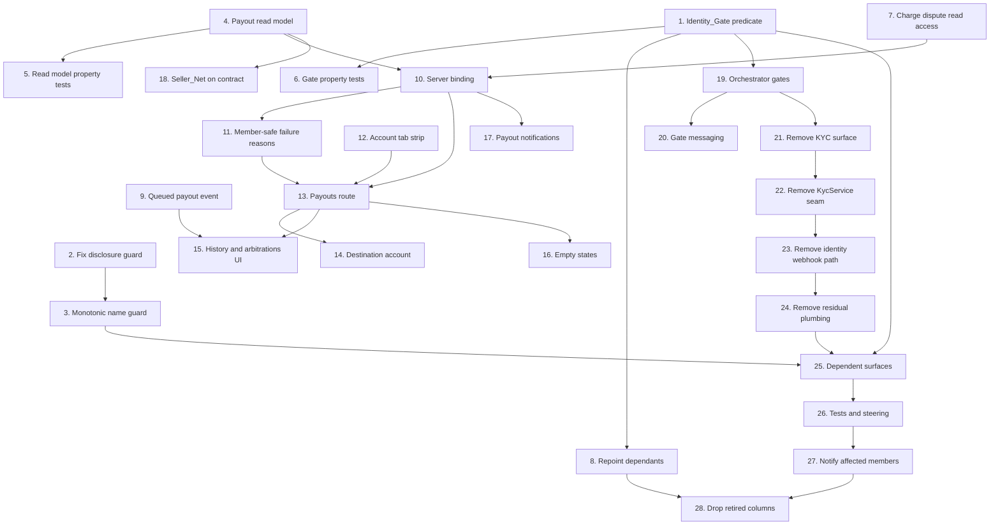

# Implementation Plan

## Overview

Two coupled changes: a member-facing Payouts dashboard, and the collapse of CardTrade's two verification signals into a single gate owned by Stripe Connect.

Ordering principle: every irreversible step is last and separately gated. Phases A to E are additive or revertible through source control. Phase F drops columns and cannot be undone, so it is not started without explicit approval.

Four findings from the codebase shape this plan:

- `public_profiles.is_verified` is **already** `merchant_status = 'APPROVED' and merchant_settlements_enabled` (migration `0032`). The Identity_Gate already exists in the database; only the sibling `identity_verified` and `identity_first_name` columns are retired.
- No enforced `kyc_status` guard exists anywhere, so Phase D **adds** gating rather than moving it.
- The header comments in `merchantOnboarding.ts` and `bondPolicy.ts` already assert this consolidation is complete. They are aspirational, not descriptive, and are corrected in Phase E.
- `sellerIdentityDisclosure` requires `registrationNumber`, but `submitMerchantOnboarding` hardcodes it to `null`, so that function can never return a disclosure. Latent bug, fixed in task 2.

## Task Dependency Graph

```json
{
  "waves": [
    { "wave": 1, "tasks": [1, 2, 4, 7, 9, 12], "rationale": "No upstream dependencies. Pure domain modules, independent migrations, and the tab strip." },
    { "wave": 2, "tasks": [3, 5, 6, 8, 10, 18, 19], "rationale": "Depend only on wave 1: guards and property tests on the new domain modules, the trigger repoint, the server binding, and the orchestrator gates." },
    { "wave": 3, "tasks": [11, 17, 20, 21], "rationale": "Depend on the server binding or on the gates existing. Removal of the KYC surface starts only once gating replaces it." },
    { "wave": 4, "tasks": [13, 22], "rationale": "The route needs the binding, failure reasons and tab strip. The seam removal follows the surface removal." },
    { "wave": 5, "tasks": [14, 15, 16, 23], "rationale": "Dashboard sections need the route shell. The webhook path is removed after the seam." },
    { "wave": 6, "tasks": [24], "rationale": "Residual data plumbing comes out once nothing reads it." },
    { "wave": 7, "tasks": [25], "rationale": "Dependent surfaces repoint once the gate is the only remaining signal in code." },
    { "wave": 8, "tasks": [26], "rationale": "Tests and steering are corrected once behaviour is final." },
    { "wave": 9, "tasks": [27], "rationale": "Members are notified only after the presented state is settled." },
    { "wave": 10, "tasks": [28], "rationale": "Destructive. Requires explicit approval and the whole of Phase E complete, because dropping a column still read by code breaks the app." }
  ]
}
```



Phase A tasks 1 to 6 have no upstream dependencies beyond each other and can start immediately. Task 28 depends on the whole of Phase E completing, because dropping a column while code still reads it breaks the app.

## Tasks

### Phase A — Pure domain foundation

- [x] 1. Add the Identity_Gate as a single reusable predicate
  - Create `domain/identity/identityGate.ts` exporting `satisfiesIdentityGate` and a `VerificationState` discriminant (`NOT_STARTED | IN_PROGRESS | NOT_APPROVED | VERIFIED`) derived from `merchant_status` plus `merchant_settlements_enabled`.
  - Treat APPROVED-without-settlements as `IN_PROGRESS`, never `VERIFIED`.
  - Keep it pure with no Supabase or provider imports so it runs in the `domain` Vitest project.
  - _Requirements: 13.1, 13.2, 13.3_

- [x] 2. Fix the seller identity disclosure guard
  - Remove the `registrationNumber` precondition from `sellerIdentityDisclosure` in `domain/orchestrator/merchantOnboarding.ts`, since registration numbers are retired vocabulary and are always written `null`.
  - Drop `registrationNumber` from `SellerIdentityDisclosure` and from the snapshot written by `submitMerchantOnboarding`.
  - Gate the disclosure on the Identity_Gate plus `legalEntityName` and `identityVerifiedAt`.
  - _Requirements: 17.1, 17.5_

- [x] 3. Add a monotonic-write guard for Verified_Identity
  - Prove in `applyComplianceUpdate` that `legalEntityName` only moves absent to present, with a unit test showing a later report without `legalName` cannot blank a stored name.
  - _Requirements: 17.3, 21.4_

- [x] 4. Build the payout read model as a pure function
  - Create `domain/payouts/payoutReadModel.ts` deriving Releasing_Now, Upcoming_Proceeds, At_Risk_Proceeds, Transfer_History entries and Arbitration_Records from plain inputs.
  - Compute Seller_Net as `max(amount_cents - platform_fee_cents, 0)`; integer cents throughout, no formatting.
  - Make bucket assignment a strict partition and history derivation order-independent.
  - _Requirements: 3.1-3.11, 5.1-5.4, 7.1-7.9, 11.1, 11.3, 11.4_

- [x] 5. Add property tests for the payout read model
  - `tests/property/payoutReadModel.test.ts` with fast-check covering partition, non-negativity, bounded-net, reconciliation, settled-is-never-owed, ordering, order-independence, idempotence, isolation and redaction.
  - _Requirements: 12.1-12.10_

- [x] 6. Add property tests for the Identity_Gate
  - `tests/property/identityGate.test.ts` covering single-source, consistency, independence from retired columns, and buyer-exemption.
  - _Requirements: 21.1, 21.2, 21.3, 21.7_

### Phase B — Non-destructive database changes

- [x] 7. Member-facing read access to charge disputes
  - New migration adding a `charge_disputes` select policy for `authenticated`, scoped by `profile_id` or by participation in the referenced `cash_sale_id` / `trade_id`.
  - Expose only amount, opened, closed and outcome; withhold `dispute_ref`, `charge_ref`, `reason`, `status`, `evidence_due_by`.
  - Grant no member write access; retain the existing admin policy unchanged.
  - Check the `is_admin` notification block in `0036_charge_disputes.sql` for identity coupling while here.
  - _Requirements: 8.1-8.7_

- [x] 8. Repoint identity dependants onto the Identity_Gate
  - New migration replacing `set_item_seller_identity_verified` and `sync_items_seller_identity_verified` so propagation fires on `merchant_status` / `merchant_settlements_enabled` rather than `kyc_status`, guarded on an actual change in value.
  - Backfill `items.seller_identity_verified` from the Identity_Gate; retain the partial index.
  - Recreate `public_profiles` without `identity_verified` and `identity_first_name`, leaving `is_verified` unchanged since it already encodes the gate.
  - Leave every retired column in place, so this is safe to apply before any code is removed.
  - _Requirements: 16.1-16.8, 16.14_

- [x] 9. Persist a queued payout event
  - Record a queued event carrying Seller_Net when a release falls due, on both the interactive completion path and the auto-complete cron, without changing `mark_cash_sale_payout_due` idempotency.
  - _Requirements: 5.5_

### Phase C — Payouts dashboard

- [x] 10. Payout read model server binding
  - Add `lib/actions/payouts.ts` resolving the viewer from the session, reading cash sales and events on the cookie-bound client, reading `merchant_*` server-side scoped to the caller, returning `ActionResult`.
  - Ignore any client-supplied identifier; never return provider refs, error strings or retry counts.
  - _Requirements: 2.1-2.7, 5.9, 6.5_

- [x] 11. Member-safe failure reasons
  - Map release failure causes to member-safe text plus a resolving action, distinguishing not-payable from provider-rejected and from retries exhausted at `MAX_PAYOUT_ATTEMPTS`. Expose no retry control.
  - _Requirements: 6.1-6.8_

- [x] 12. Account tab strip
  - Add the tab strip across account-area routes with `aria-current="page"` on the active route.
  - _Requirements: 1.2_

- [x] 13. Payouts route and sections
  - Add the route as a dynamic Server Component rendering Balance_Summary, Destination_Account_Summary, Transfer_History and Arbitration_Summary in order.
  - Register it in both `PROTECTED_PREFIXES` and `config.matcher`; redirect unauthenticated visitors with `redirectTo`.
  - Label the headline "Releasing now"; expose no withdraw control.
  - _Requirements: 1.1, 1.3-1.8, 3.8, 3.9_

- [x] 14. Destination account summary
  - Show the Member's own Verified_Identity from Connect state, the payout-capability state, and an update action requesting a fresh hosted link per attempt.
  - Show no bank digits, masked or otherwise; state that the provider holds payout details.
  - _Requirements: 4.1-4.8_

- [x] 15. Transfer history and arbitrations UI
  - Entries, ordering, plain-language sentences, bank-timing caveat, arbitration records and links.
  - Active/past scoping wired via `resolveScope` / `SectionFilter`, splitting in-flight movements (queued, failed) from completed ones (sent, fraud restitution).
  - _Requirements: 5.2-5.11, 7.10-7.13, 11.5-11.8_

- [x] 16. Empty and pre-onboarding states
  - Cover no-sales, `merchant_status` NONE / PENDING / REJECTED, no-history, no-arbitrations, and read-model failure without rendering a zero balance.
  - _Requirements: 10.1-10.8_

- [x] 17. Payout notifications
  - Emit to the Seller only, on settle and on transition into FAILED, with no duplicate on repeat failures or repeat settles; keep the release outcome unchanged if notification insertion fails.
  - _Requirements: 9.1-9.7_

- [x] 18. Surface Seller_Net on the sale contract
  - Widen the select in `app/sales/[id]/page.tsx` and add a "You receive" row plus release status to `CashSaleView`.
  - _Requirements: 1.7, 3.10_

### Phase D — Enforce the gate

- [x] 19. Orchestrator gates
  - Require the Identity_Gate to publish an Item for cash sale, to enter a Trade escrow, and to create or join a cash-bearing private deal, returning typed `ActionResult` failures.
  - Require a saved payment method for a cash Buyer to accept terms; require no gate of a cash Buyer otherwise.
  - Leave already-published items visible and unchanged.
  - _Requirements: 14.1-14.10_

- [x] 20. Gate messaging in the UI
  - Every orchestrator guard returns a member-safe message naming the blocked action and pointing at payout setup.
  - `/listings/new` now checks the gate on RENDER and shows the refusal before the form, so a blocked member does not photograph an item and write a description first.
  - _Requirements: 14.6, 14.7_

### Phase E — Retire the payer gate in code

- [x] 21. Remove the member-facing KYC surface
  - Delete `app/kyc/`, `lib/actions/kyc.ts`, `components/kyc/`; remove `/kyc` from `middleware.ts` (both lists), `app/robots.ts` and `app/sitemap.ts`.
  - Remove the identity card and link from `app/profile/page.tsx` and correct its header comment.
  - _Requirements: 15.1-15.5_

- [x] 22. Remove the KycService seam
  - Remove `KycService`, `runVerification`, `IdentityCheckSession` and `beginIdentityCheck` from `domain/services/types.ts` and from `StripeService`, `MockService` and `InMemoryService` in one pass.
  - Remove `StripeKycMode`, `kycMode`, `STRIPE_KYC_MODE`, and the stale "always the Mock delegate" comment in `domain/services/index.ts`.
  - Run `npx tsc --noEmit` after, per the steering note about SDK types.
  - _Requirements: 15.6-15.9_

- [x] 23. Remove the identity webhook path
  - Remove the `identity.verification_session.*` translation, the `kyc.verified` / `kyc.rejected` mappings, and the `kyc_status` / `identity_verified_*` writes in `webhookPipeline.ts`.
  - Confirm an unmapped authentic event is a logged no-op acked with success.
  - _Requirements: 15.10-15.12_

- [x] 24. Remove residual KYC data plumbing
  - Remove the `kyc_status` initialisation in `lib/actions/auth.ts` and `lib/auth/ensureProfile.ts`, and the `KycStatus` type and `BuyerRecord.kycStatus` from the cash sale orchestrator and repository.
  - _Requirements: 15.13, 15.14_

- [x] 25. Update dependent surfaces
  - Point `IdentityBadge`, `CounterpartyIdentity`, `CatalogControls`, the listings seller flags, the deals gate, `KycRailStatus` and `app/listings/[id]/page.tsx` at the Identity_Gate, and collapse identity-versus-payability wording to one state.
  - Derive the Bond_Policy verified input from the Identity_Gate, keeping the buyer-posts-no-bond asymmetry.
  - _Requirements: 18.1-18.8_

- [x] 26. Update tests and steering
  - Update or remove tests asserting retired-gate behaviour so the suite passes.
  - Correct `product.md` (the gate it describes does not exist), `tech.md` (`STRIPE_KYC_MODE`) and `stripe-payments.md`; record the Identity_Gate as the single signal and the accepted assurance change.
  - _Requirements: 13.7, 15.15, 15.16, 20.1-20.5_

- [x] 27. Notify affected members
  - Notify any Member whose presented verification state changes, stating verification is now provider-handled and linking to payout setup.
  - _Requirements: 19.1-19.3_

### Phase F — Destructive migration (requires explicit approval)

- [x] 28. Drop the retired columns
  - **Not to be started without explicit approval. Irreversible.** Drops verification records produced by real Stripe Identity document checks.
  - New migration dropping `kyc_status`, `kyc_reason`, the `kyc_status` enum, and `identity_verified_name` / `identity_verified_first_name` / `identity_verified_at` / `identity_is_adult` / `identity_session_id`.
  - Preserve the seller identity already snapshotted on `cash_sales`; confirm grants are not widened; retain RLS.
  - Regenerate `lib/supabase/database.types.ts`; update `supabase/seed.sql` and `supabase/seeds/`.
  - Confirm in-flight contracts are untouched and queued money is not stranded.
  - _Requirements: 16.2, 16.9-16.14, 19.4-19.6_

### Phase G — Close the remaining money gaps

- [x] 29. Remove the verified-seller catalog filter
  - Publishing now requires the Identity_Gate, so every catalog item has a verified seller and the filter matched everything. Removed from `listings.ts`, `CatalogControls`, `CatalogInfiniteGrid` and `app/listings/page.tsx`; `items.seller_identity_verified` is retained and still drives per-card badges.
  - _Requirements: 18.1, 18.3_

- [x] 30. Add a refund primitive to the payment seam
  - `refundPayment` on `PaymentService`, returning a `RefundResult` and reporting failure through `status`. Implemented in `StripeService` (`refunds.create`, keyed on the persisted nonce, treating `pending` as success), `MockService` (deterministic) and `InMemoryService` (recorded and deduplicated by nonce).
  - `reverse_transfer` deliberately unset: under separate charges and transfers the Seller has not been paid when a dispute resolves.
  - _Requirements: 22.1, 22.2_

- [x] 31. Cash_Sale dispute resolution
  - Migration `0044`: resolution and refund columns, `mark_cash_sale_refund_due` for atomic nonce assignment, and a partial index on open disputes.
  - `resolveCashSaleDispute` in the orchestrator with three outcomes, refund attempted before the sale leaves DISPUTED, idempotent on re-resolution, Seller_Net reduced by the refund.
  - Admin-gated `resolveCashSaleDispute` action, `DisputeActions` island, and a Disputed sales section leading the admin console.
  - Both parties notified in their own terms; auditable event naming the outcome and the deciding admin.
  - Corrected `HandoverFailedDialog`, which promised an automatic refund that could not happen.
  - 12 unit tests in `tests/unit/cashSaleDispute.test.ts`.
  - _Requirements: 22.3-22.18_

- [x] 32. Schedule the release drain
  - `vercel.json` cron at :47, plus a GET handler because Vercel Cron issues GET and the route was POST-only — which is why the drain only ever ran when an operator pressed the button.
  - _Requirements: 23.1-23.4_

- [x] 33. Reconcile demo profiles
  - Backfilled `merchant_legal_entity_name`, `merchant_identity_verified_at`, consent and version for approved profiles missing them, and fixed `supabase/seeds/demo_kitsunearia.sql` to seed Connect columns instead of the dropped payer-gate ones. A profile that satisfied the gate but had no disclosable identity showed a verified badge while being unable to sell.
  - _Requirements: 17.1, 19.1_

- [x] 34. Fix the navigation graph link scanner
  - The link regex excluded all three quote characters, so any template-literal href containing a quote (e.g. `?? ''`) truncated and vanished. That made `/trades/new` look like an orphan when the trade proposal inbox links to it. Split into quoted and template patterns.

## Notes

- Validate with `npm run test` or a targeted Vitest project. Do not run `npm run build` or `npm run typecheck` as routine verification, per `tech.md`; the exception is `npx tsc --noEmit` after task 22, which the steering doc explicitly requires after changing `domain/services/types.ts`.
- Layering is one-directional: `app/` → `components/` → `lib/` → `domain/`. Anything property tests must reach belongs in `domain/`.
- Server Actions stay thin: authenticate, gate, validate, delegate to an orchestrator, revalidate. Expected failures are `ActionResult` values, never exceptions.
- Authorization is enforced twice: RLS on the cookie-bound client and an explicit guard in the orchestrator. Both are required on every new read and write path.
- `payoutCashSaleSeller` is idempotent through the persisted `seller_payout_nonce`, and an already-SETTLED release is a no-op success. Tasks 9 and 17 must not change that.
- Migration `0033` is the structural model for task 8: insert trigger, propagation trigger guarded on an actual change, backfill, partial index.
- `0005_merchant_onboarding.sql` revokes column `UPDATE` on `profiles` from `authenticated` to prevent self-promotion. Task 28 must not widen those grants.
- Stripe Connect accounts are created with `stripe.v2.core.accounts.create`; the v1 endpoint is hard-blocked despite the SDK still typing its `controller` parameter.
