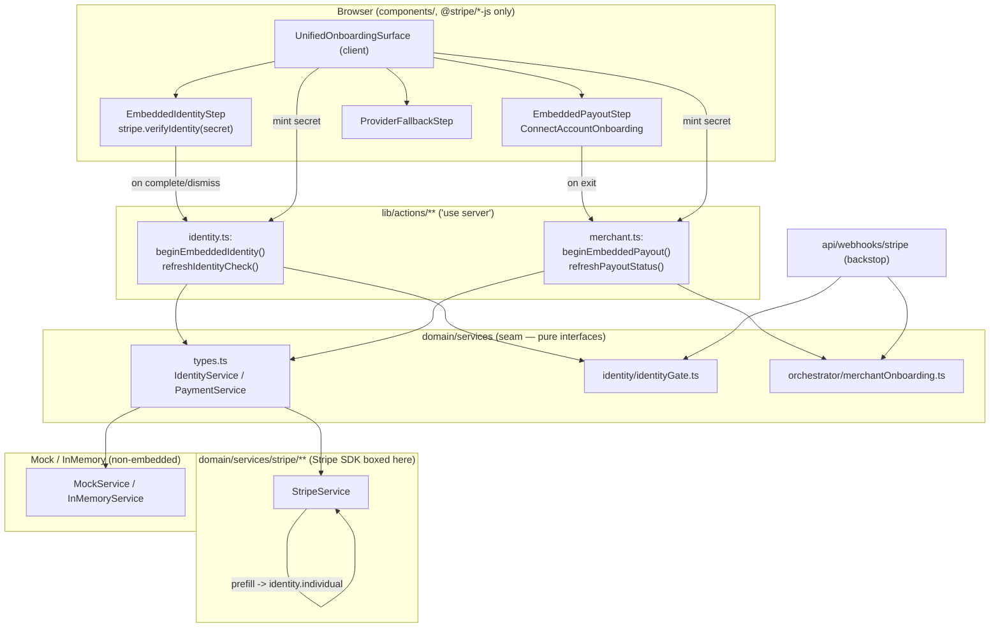

# Design Document

## Overview

This design replaces the two provider-hosted redirects a seller currently walks
through — a Stripe Identity hosted session, then a Connect account-link form — with
**one NoDitto page** that hosts both steps inline. The Identity step renders through
`@stripe/stripe-js` (`stripe.verifyIdentity`), the Payout step through
`@stripe/connect-js` + `@stripe/react-connect-js` (the `account_onboarding` embedded
component). Both are driven by **client secrets minted server-side behind the payment
seam**; the Stripe server SDK stays boxed inside `domain/services/stripe/**`.

Three things are load-bearing and are stated here so nothing downstream loosens them:

1. **The UI is unified; the two gates are not.** `identity_check_status = VERIFIED`
   still gates listing/selling/trading through `domain/identity/identityGate.ts` and
   nothing else; `merchant_status = APPROVED` + `merchant_settlements_enabled` still
   gates payouts through `canReceiveFunds`. No Connect column enters a gate
   expression. `tests/property/identityGate.test.ts` keeps throwing if one does.
2. **Prefill reintroduces DOB and address onto the seam, transiently.** Only the
   verified NAME is persisted (`identity_check_name`, monotonic absent→present). DOB
   and address travel from the Identity session's `verified_outputs` straight into the
   Connect account-create body as a `prefill` sub-object that is **never persisted,
   logged, or returned to a client component**.
3. **Read-back is the reliable path; the webhook is the backstop.** Every return from
   an embedded step calls `refreshIdentityCheck` / `refreshPayoutStatus`. The webhook
   pipeline reconciles as a backstop only.

### Scope of change

| Layer | Change |
| --- | --- |
| `domain/services/types.ts` | Transient `verifiedDob`/`verifiedAddress` on `IdentityCheck`; transient `prefill` on `ManagedMerchantDetails`; two optional mint methods (`createIdentitySessionSecret`, `createConnectAccountSession`); a `publishableKey` accessor. Mock + InMemory updated in the same pass. |
| `domain/services/stripe/StripeService.ts` | Expand `verified_outputs.dob`/`.address` in `readIdentityCheck`; map `prefill` → `identity.individual` on `v2.core.accounts.create`; implement `createConnectAccountSession` (`accountSessions.create`) and `createIdentitySessionSecret` (surface the session `client_secret`). |
| `lib/actions/*` | New/expanded server actions that mint secrets and run read-backs for the embedded flow. |
| `components/onboarding/**` | New client components: the surface, the embedded Identity step, the embedded Payout step, and the fallback. |
| `app/onboarding` | The unified surface route. |
| Webhook | Unchanged translation continues to backstop both `identity.verification_session.*` and `account.updated`. |

## Architecture

### Layered placement

The change respects the one-directional dependency flow. `domain/` stays pure (the
seam types, the gate, the orchestrator); the Stripe SDK stays inside
`domain/services/stripe/**`; server actions in `lib/actions/**` are the only place that
mints secrets and runs read-backs; `components/**` consume only browser SDKs plus the
publishable key and server-minted secrets.



### Component / data-flow: the happy path

```mermaid
sequenceDiagram
  participant S as Seller (browser)
  participant U as UnifiedOnboardingSurface
  participant A as Server Actions
  participant P as Payment Seam (Stripe binding)
  participant DB as profiles (admin write)

  Note over U: Step 1 — Identity
  U->>A: beginEmbeddedIdentity()
  A->>P: createIdentityCheck() [persist PENDING + session id]
  A->>P: createIdentitySessionSecret(sessionId)
  P-->>A: { clientSecret, publishableKey }
  A-->>U: secret + publishable key
  U->>S: stripe.verifyIdentity(clientSecret) — modal (doc + selfie in Stripe iframe)
  S-->>U: modal resolves/dismisses
  U->>A: refreshIdentityCheck()  (RELIABLE PATH)
  A->>P: readIdentityCheck(sessionId) expand verified_outputs(.dob,.address)
  P-->>A: outcome=VERIFIED, verifiedName, verifiedDob, verifiedAddress (transient)
  A->>DB: identity_check_status=VERIFIED; identity_check_name (absent->present only)
  Note over A: DOB/address NOT written, NOT logged

  Note over U: Step 2 — Payout (only name/dob/address prefilled silently)
  U->>A: beginEmbeddedPayout()
  A->>P: readIdentityCheck(sessionId) -> Prefill_Object {name,dob,address}
  A->>P: createManagedMerchant({ ...details, prefill }) -> identity.individual.*
  P-->>A: merchant PENDING (settlements inactive)
  A->>P: createConnectAccountSession(merchantRef) [account_onboarding]
  P-->>A: { clientSecret, publishableKey }
  A-->>U: secret + publishable key
  U->>S: ConnectAccountOnboarding (bank + agreement in Stripe iframe)
  S-->>U: onExit
  U->>A: refreshPayoutStatus()  (RELIABLE PATH)
  A->>P: getManagedMerchant() -> settlementsEnabled = (stripe_transfers.status==='active')
  A->>DB: applyComplianceUpdate -> merchant_status re-derived
```

## Components and Interfaces

### 1. Seam changes — `domain/services/types.ts`

The seam is where the sharpest risk lives, so the changes are deliberately minimal and
every sensitive addition is marked transient in its own JSDoc.

#### 1.1 `IdentityCheck` gains transient verified DOB + address

```ts
export interface IdentityCheck {
  sessionId: string;
  outcome: IdentityCheckOutcome;
  verifiedName: string | null;
  verifiedAt: string | null;
  hostedUrl?: string | null;
  failureReason?: string | null;

  /**
   * TRANSIENT, SERVER-ONLY. Date of birth read off the verified document, surfaced
   * ONLY so it can be prefilled into Connect account creation in the same request.
   * NEVER persisted to a NoDitto table, NEVER logged, NEVER returned to a client
   * component. Present only after `readIdentityCheck` expands `verified_outputs.dob`.
   */
  verifiedDob?: { day: number; month: number; year: number } | null;

  /**
   * TRANSIENT, SERVER-ONLY. Verified residential address, same handling rules as
   * {@link IdentityCheck.verifiedDob}. Present only after `readIdentityCheck` expands
   * `verified_outputs.address`.
   */
  verifiedAddress?: {
    line1?: string | null;
    line2?: string | null;
    city?: string | null;
    state?: string | null;
    postalCode?: string | null;
    country?: string | null;
  } | null;
}
```

These fields are optional so Mock/InMemory need no data to satisfy them, and so the
existing `readIdentityCheck` callers (`refreshIdentityCheck`) keep compiling — they
simply ignore them, which is correct: the read-back persists only the name.

#### 1.2 New mint methods on the seam

Two new **optional** methods, added to `IdentityService` and `PaymentService`
respectively so the many `PaymentService`-only fakes do not have to grow them, and so a
non-embedded provider can leave them undefined (which is the fallback signal).

```ts
/** A short-lived credential to render an embedded Stripe component in the browser. */
export interface EmbeddedClientSecret {
  /**
   * The single-use secret handed to the browser SDK. Scoped to one component render
   * and useless for anything else, but still never logged.
   */
  clientSecret: string;
  /** Publishable/browser-safe key. The ONLY key material that may reach the client. */
  publishableKey: string;
  /** Provider expiry, when known — the surface mints a fresh one rather than reusing. */
  expiresAt?: string;
}

// added to IdentityService:
/**
 * Mint an Identity session client secret for `stripe.verifyIdentity` (Req 2.1, 7.1).
 * Today only `hostedUrl` is surfaced; this exposes the session `client_secret` for the
 * embedded modal. Optional so Mock/InMemory compile without it (fallback signal).
 */
createIdentitySessionSecret?(sessionId: string): Promise<EmbeddedClientSecret>;

// added to PaymentService:
/**
 * Mint a Connect account-session client secret for embedded onboarding (Req 5.1, 7.1).
 * Optional on the contract for the same reason as the merchant methods.
 */
createConnectAccountSession?(merchantRef: string): Promise<EmbeddedClientSecret>;
```

Naming: `createIdentitySessionSecret` / `createConnectAccountSession` read as "mint the
secret for X", parallel to the existing `beginInstrumentSetup` which already returns a
`clientSecret` + `publishableKey`. The presence of these two methods is what the surface
tests to decide embedded-vs-fallback (Req 10.1).

#### 1.3 `ManagedMerchantDetails` gains a transient `prefill`

```ts
export interface ManagedMerchantDetails {
  profileId: string;
  businessEmail: string;
  tradingName?: string;
  legalEntityName?: string;
  country?: string | null;

  /**
   * TRANSIENT, PROVIDER-SOURCED PREFILL. Name/DOB/address read from the seller's
   * Identity `verified_outputs` and forwarded to Stripe as `identity.individual`
   * fields at account creation, so the seller is never re-asked for what Stripe
   * already verified (Req 4.1, 4.2).
   *
   * NEVER PERSISTED to any NoDitto table, NEVER logged, NEVER returned to a client
   * component (Req 4.3-4.5, 9.3, 9.4). It exists on this DTO only to travel from the
   * read-back into `createManagedMerchant` inside a single server request, and is
   * dropped the moment the account-create body is built. A field absent here is
   * collected normally by Stripe inside its own iframe (Req 4.6).
   */
  prefill?: {
    firstName?: string | null;
    lastName?: string | null;
    dob?: { day: number; month: number; year: number } | null;
    address?: {
      line1?: string | null;
      line2?: string | null;
      city?: string | null;
      state?: string | null;
      postalCode?: string | null;
      country?: string | null;
    } | null;
  };
}
```

`prefill` deliberately does **not** widen `MerchantRecord` or any persisted
`MerchantUpdate` in the orchestrator: it lives only on the create DTO. That keeps the
"never persisted" guarantee a structural fact rather than a discipline.

#### 1.4 Mock and InMemory in the same pass (Req 7.4)

Both already implement `createIdentityCheck` / `readIdentityCheck` / `createManagedMerchant`.
The same pass adds:

- `createIdentitySessionSecret(sessionId)` → returns a deterministic
  `{ clientSecret: 'ident_secret_<hash>', publishableKey: 'pk_test_mock' }`.
- `createConnectAccountSession(merchantRef)` → deterministic
  `{ clientSecret: 'acct_secret_<hash>', publishableKey: 'pk_test_mock' }`.
- `readIdentityCheck` may return `verifiedDob`/`verifiedAddress` as `null` (Mock has no
  document) — the prefill mapping then simply omits those fields, exercising Req 4.6.

Because these are also **optional** on the interface, a design choice is available: the
Mock MAY implement them (deterministic embedded testing) or MAY leave them undefined to
exercise the fallback. This design has the Mock **leave `createConnectAccountSession`/
`createIdentitySessionSecret` undefined**, so the fallback path (Req 10.1, 10.2) is the
default local experience and the deterministic mock flow drives the gates through the
existing seam methods.

### 2. StripeService changes — `domain/services/stripe/StripeService.ts`

All four changes stay inside the boxed binding.

#### 2.1 `readIdentityCheck` expands DOB + address

```ts
async readIdentityCheck(sessionId: string): Promise<IdentityCheck> {
  const session = await this.stripe.identity.verificationSessions.retrieve(sessionId, {
    // verified_outputs is not returned by default. Its sub-objects dob/address are
    // needed transiently for prefill; the name path already relied on this expand.
    expand: ['verified_outputs'],
  });
  return this.toIdentityCheck(session);
}
```

`toIdentityCheck` is extended to project `verified_outputs.dob` and
`verified_outputs.address` onto the transient fields (guarded to `outcome === 'VERIFIED'`,
matching the name). The name projection is unchanged.

> SDK note: `verified_outputs.dob` is `{ day, month, year }` and `verified_outputs.address`
> is a standard Stripe `Address`. These field paths are validated by `npx tsc --noEmit`
> after the `types.ts` edit — the SDK ships types under `node_modules/stripe/esm/`, and
> editor diagnostics have been observed passing where `tsc` then fails.

#### 2.2 `createManagedMerchant` prefill mapping

The existing create body already sets `identity: { country, entity_type: 'individual' }`.
The mapping adds `identity.individual` from `details.prefill`, omitting any absent field
so Stripe collects it (Req 4.6):

```ts
identity: {
  country: resolveAccountCountry(details.country, this.opts.config.country),
  entity_type: 'individual',
  ...(details.prefill
    ? {
        individual: pruneEmpty({
          given_name: details.prefill.firstName ?? undefined,
          surname: details.prefill.lastName ?? undefined,
          date_of_birth: details.prefill.dob
            ? {
                day: details.prefill.dob.day,
                month: details.prefill.dob.month,
                year: details.prefill.dob.year,
              }
            : undefined,
          address: details.prefill.address
            ? pruneEmpty({
                line1: details.prefill.address.line1 ?? undefined,
                line2: details.prefill.address.line2 ?? undefined,
                city: details.prefill.address.city ?? undefined,
                state: details.prefill.address.state ?? undefined,
                postal_code: details.prefill.address.postalCode ?? undefined,
                country: details.prefill.address.country ?? undefined,
              })
            : undefined,
        }),
      }
    : {}),
},
```

`prefill` MUST NOT be folded into the idempotency-key `fingerprint(body)` in a way that
would deadlock a retry, and it MUST NOT be written to the `metadata` block — metadata is
persisted at Stripe and readable back, which would violate "never persisted/logged". The
existing metadata (profile id, stated/trading name) is unchanged. The verified-name
mapping onto `identity.individual.{given_name,surname}` matches the field paths the
existing `fromV2Account` reader already reads back (`identity.individual.given_name/surname`),
so disclosure and prefill agree on one shape.

#### 2.3 `createConnectAccountSession` — embedded onboarding

```ts
/**
 * Mint an account-session client secret for the embedded `account_onboarding`
 * component (Req 5.1). Recipient accounts collect only what remains — bank account
 * and the service agreement — so only the onboarding component is enabled.
 */
async createConnectAccountSession(merchantRef: string): Promise<EmbeddedClientSecret> {
  const publishableKey = this.opts.config.publishableKey;
  if (!publishableKey) {
    throw new Error('[payments] publishable key missing; cannot render embedded onboarding.');
  }
  const session = await this.stripe.accountSessions.create({
    account: merchantRef,
    components: { account_onboarding: { enabled: true } },
  });
  return {
    clientSecret: session.client_secret,
    publishableKey,
    expiresAt: new Date(session.expires_at * 1000).toISOString(),
  };
}
```

`accountSessions.create` with `components.account_onboarding.enabled: true` returns
`client_secret` — confirmed against the installed `stripe@22.4.0` type
`AccountSessionCreateParams` / `AccountSession`.

#### 2.4 `createIdentitySessionSecret` — embedded modal

`stripe.verifyIdentity` needs the session's `client_secret` (not its `url`). Rather than
widen the always-returned `IdentityCheck` with a sensitive secret, a dedicated mint
method reads the session and returns only what the browser needs:

```ts
async createIdentitySessionSecret(sessionId: string): Promise<EmbeddedClientSecret> {
  const publishableKey = this.opts.config.publishableKey;
  if (!publishableKey) throw new Error('[payments] publishable key missing.');
  const session = await this.stripe.identity.verificationSessions.retrieve(sessionId);
  if (!session.client_secret) {
    throw new Error('[payments] Identity session has no client secret (already consumed).');
  }
  return { clientSecret: session.client_secret, publishableKey };
}
```

A consumed/terminal session has no `client_secret`, which is exactly the "mint fresh on
retry" contract (Req 13.4): the surface starts a new session rather than reusing a dead
secret.

### 3. Server actions — `lib/actions/**`

The actions are thin and keep the existing failure discipline (errors are values, gate
state untouched on any provider failure — Req 2.6, 13.5).

- `lib/actions/identity.ts`
  - **new** `beginEmbeddedIdentity(): ActionResult<{ clientSecret, publishableKey, sessionId }>`
    — resumes/creates the session (persist PENDING as today), then calls
    `createIdentitySessionSecret`. If either provider call fails, returns an error and
    leaves `identity_check_status` unchanged. If the binding lacks
    `createIdentitySessionSecret`, returns `NOT_SUPPORTED` (the surface falls back).
  - `refreshIdentityCheck()` — unchanged behaviour; remains the reliable read-back.
    Still writes `identity_check_name` monotonically and never DOB/address.
  - `beginIdentityCheck()` (hosted) — **kept as fallback** (see §9), not deleted.
- `lib/actions/merchant.ts`
  - **new** `beginEmbeddedPayout(): ActionResult<{ clientSecret, publishableKey }>` —
    ensures the account shell exists (reusing `submitMerchantOnboarding` with
    `buyerDisclosureConsent: true`), builds the `Prefill_Object` from a fresh
    `readIdentityCheck`, passes it to `createManagedMerchant`, then mints the account
    session via `createConnectAccountSession`. Refuses when the trading region is
    absent/non-tradeable (Req 12.2) and when a `merchant_ref` region move is attempted
    (Req 12.4, via `setTradingRegion` unchanged).
  - `refreshPayoutStatus()` — unchanged; remains the reliable read-back.
  - `createPayoutOnboardingLink()` / `startIdentityVerification()` — **kept as fallback**.

**Prefill is assembled and consumed within one server action invocation.** It is read
from `readIdentityCheck`, handed to `createManagedMerchant`, and never returned in the
action result. The action's return type carries only `{ clientSecret, publishableKey }`
— structurally incapable of leaking DOB/address to the client (Req 4.5).

### 4. Browser integration — `components/onboarding/**`

New client components, browser SDKs only (Req 7.3). New dependencies:
`@stripe/connect-js`, `@stripe/react-connect-js`. `@stripe/stripe-js` and
`@stripe/react-stripe-js` already exist in `package.json`.

- `UnifiedOnboardingSurface.tsx` — `'use client'`. Orchestrates the two steps, renders
  independent completion state (Req 1.5), presents Identity before Payout (Req 1.3),
  and never navigates to a stripe.com host (Req 1.2). Resumes each step from a read-back
  on mount / on the return marker (Req 13.3).
- `EmbeddedIdentityStep.tsx` — calls `beginEmbeddedIdentity`, loads Stripe.js with the
  publishable key, invokes `stripe.verifyIdentity(clientSecret)`; on resolve/dismiss
  calls `refreshIdentityCheck` (Req 2.5).
- `EmbeddedPayoutStep.tsx` — calls `beginEmbeddedPayout`, initialises
  `loadConnectAndInitialize({ publishableKey, fetchClientSecret })` from
  `@stripe/connect-js`, renders `<ConnectAccountOnboarding onExit={...}>` from
  `@stripe/react-connect-js`; on exit calls `refreshPayoutStatus` (Req 6.1).
- `ProviderFallbackStep.tsx` — rendered when the mint action returns `NOT_SUPPORTED`;
  drives the hosted/mock flow through the existing seam methods and explains which step
  is embedded-unavailable and why (Req 10.1, 10.4).

`PayoutOnboarding.tsx` (existing) is refactored: the compact "payout destination" card
stays for the profile/payouts surfaces, but its hosted-redirect action becomes the
fallback path invoked by `ProviderFallbackStep`; the embedded path is preferred.

### 5. Two-gate model preserved

The single surface keeps the gates independent by keeping their *inputs* independent:

- **Identity_Gate** reads only `identity_check_status`. `identityGate.ts` is unchanged.
  `beginEmbeddedIdentity`/`refreshIdentityCheck` write only `identity_check_status` and
  `identity_check_name`.
- **Payout_Gate** reads only `merchant_status` + `merchant_settlements_enabled` via
  `canReceiveFunds`. `beginEmbeddedPayout`/`refreshPayoutStatus` write only the
  `merchant_*` columns through `applyComplianceUpdate`.
- The surface renders the two step statuses from two separate reads. A verified seller
  with no payout account renders "identity done, payout pending" and can leave and
  resume at the Payout step (Req 1.6, 8.3). A member who somehow satisfied payout
  without identity is still refused listing/selling/trading, because those gate on
  `satisfiesIdentityGate` alone (Req 8.4).
- **No Connect column appears in any gate expression.** The existing
  `tests/property/identityGate.test.ts` guard (throws if `merchant_status` /
  `merchant_settlements_enabled` reappears in a gate expression) stays green.

### 6. Silent prefill flow — order of operations

1. Identity step completes → `refreshIdentityCheck` reads the session back and persists
   `VERIFIED` + name (absent→present only). DOB/address are **not** written.
2. Payout step begins → `beginEmbeddedPayout` performs a fresh `readIdentityCheck`
   (server-only) to obtain `verifiedName`/`verifiedDob`/`verifiedAddress`.
3. It builds the `Prefill_Object` and calls `createManagedMerchant({ ..., prefill })`,
   which maps to `identity.individual.{given_name,surname,date_of_birth,address}`.
4. It mints the Connect account session; the embedded component collects **only what
   remains** — the disbursement bank account and the service agreement.
5. **No confirm/edit screen** is shown for prefilled fields (Req 4.7); the seller sees
   only the residual fields Stripe still needs.

If a field is absent from `verified_outputs`, the prefill omits it and Stripe's own
onboarding collects it inside its iframe (Req 4.6).

### 7. Provider fallback

`getPaymentService(region)` may return a binding without the mint methods (the Mock, or
any non-embedded provider). The surface probes capability by attempting the mint action:

- Mint returns `NOT_SUPPORTED` → `ProviderFallbackStep` renders. For **MockService** it
  drives the deterministic mock flow (create session/account, then read back), still
  writing `identity_check_status` and `merchant_status` through the same seam methods
  (Req 10.2, 10.3). For any other non-embedded provider it uses the hosted-redirect
  fallback.
- The fallback never renders an empty embedded component; it states which step is
  embedded-unavailable and why (Req 10.4).

### 8. Webhook backstop

No new event types. The existing translation continues to backstop both sides:

- `identity.verification_session.verified` / `.requires_input` →
  `identity.verified` / `identity.failed`, reconciled onto `identity_check_status` and
  the monotonic name. A webhook payload with no `verified_outputs` leaves an existing
  name unchanged (Req 3.6).
- `account.updated` → `merchant.compliance.updated`, reconciled onto the `merchant_*`
  columns via `applyComplianceUpdate`.

Read-back remains the reliable path in both cases; the gate never depends on the webhook
alone (Req 6.4). (Note: v2 account events route to the "My account" endpoint — the read-
back is why "did onboarding finish" is answered without waiting on a delivery.)

### 9. Impact on existing code — keep vs retire

| File / path | Decision |
| --- | --- |
| `app/onboarding/page.tsx` | **Modify.** The seller "intent" branch stops redirecting to a hosted Identity URL and instead routes to / mounts the `UnifiedOnboardingSurface`. Welcome/username/region/buyer-card steps are retained. |
| `components/profile/PayoutOnboarding.tsx` | **Modify.** Embedded payout preferred; its hosted-redirect action demoted to the fallback path. Compact card retained for `/profile/payouts`. |
| `lib/actions/identity.ts` | **Modify (additive).** Add `beginEmbeddedIdentity`; keep `beginIdentityCheck` (hosted) as fallback. `refreshIdentityCheck` unchanged. |
| `lib/actions/merchant.ts` | **Modify (additive).** Add `beginEmbeddedPayout`; keep `createPayoutOnboardingLink` / `startIdentityVerification` as fallback. `refreshPayoutStatus` unchanged. |
| `createIdentityCheck` hosted URL (`hostedUrl`) | **Keep as fallback.** Non-embedded providers and the mock still need it. |
| `createMerchantOnboardingLink` (account links) | **Keep as fallback.** Same reason. |

Retiring the hosted paths is explicitly **not** done: Req 10 requires a defined
fallback, and the mock has no embedded components, so the hosted/mock code stays as the
degrade path.

### 10. New dependencies, env, and verification

**Dependencies** (browser only): `@stripe/connect-js`, `@stripe/react-connect-js`.
`@stripe/stripe-js` (`9.12.1`) and `@stripe/react-stripe-js` (`6.8.0`) already present.
Server SDK `stripe@22.4.0` unchanged.

**Env**: no new variables. `NEXT_PUBLIC_STRIPE_PUBLISHABLE_KEY[_REGION]` already exists
and is the only key surfaced to the browser (Req 7.5). `readStripePublishableKey`
already resolves it per region.

**Verification steps**:

- `npx tsc --noEmit` after editing `domain/services/types.ts` (the SDK ships its types
  under `node_modules/stripe/esm/`; editor diagnostics are not sufficient). This
  validates the `verified_outputs.dob`/`.address`, `identity.individual.*` and
  `accountSessions.create` field paths.
- `npx vitest --run tests/property/identityGate.test.ts` — the two-gate independence
  and Connect-column-absent guards.
- `npx vitest --run tests/unit/mobileDomainAgreement.test.ts` — keep the seam contract
  and refused-vocabulary guards consistent after the `types.ts` change (Req 14.2).
- Existing merchant-onboarding / seam unit tests updated for the new fake methods.

## Data Models

No schema migration. All persisted state already exists:

- `profiles.identity_check_status`, `identity_check_name`, `identity_check_session_id`,
  `identity_check_verified_at` — the Identity_Gate side.
- `profiles.merchant_ref`, `merchant_status`, `merchant_settlements_enabled`,
  `merchant_legal_entity_name`, etc. — the Payout side.

New data structures are **transient, in-memory only**: `IdentityCheck.verifiedDob` /
`verifiedAddress`, `ManagedMerchantDetails.prefill`, and `EmbeddedClientSecret`. None is
written to a table, appears in a select list, or is returned to a client component.

## Error Handling

- **Mint failure** (`createIdentitySessionSecret` / `createConnectAccountSession` throws)
  → the action returns a typed error; the surface shows a retry action for that step;
  gate state is unchanged (Req 13.1).
- **Provider call failure in either step** → error result, and neither
  `identity_check_status` nor `merchant_status` is written (Req 2.6, 13.5). This is the
  existing "throw on create, values on read" discipline preserved.
- **Read-back reports incomplete** → the surface keeps the seller on that step and
  allows re-entry (Req 13.2); a fresh secret is minted on the next attempt (Req 13.4).
- **Region absent / non-tradeable** → `beginEmbeddedPayout` refuses account creation
  (Req 12.2). **`merchant_ref` already exists** → `setTradingRegion` refuses (Req 12.4).
- **Non-embedded provider** → fallback rather than an empty component (Req 10.1).

## Correctness Properties

*A property is a characteristic or behavior that should hold true across all valid
executions of a system — a formal statement about what the system should do. Properties
bridge the human-readable spec and machine-verifiable guarantees.*

### Property 1: Provider failure leaves both gate statuses unchanged

*For any* onboarding step (Identity or Payout) and *any* failing provider call
(mint, create, or read), the corresponding server action returns an error result and
performs no write to `identity_check_status` or `merchant_status`.

**Validates: Requirements 2.6, 13.1, 13.5**

### Property 2: The verified name is written monotonically

*For any* prior persisted name state and *any* provider report (read-back or webhook,
with or without `verified_outputs`), the persisted `identity_check_name` equals the
prior name when one was already present, and only ever transitions absent→present —
never present→absent and never present→different.

**Validates: Requirements 3.3, 3.6, 9.2**

### Property 3: The two gates are independent

*For any* combination of `merchant_status` and `merchant_settlements_enabled`,
`satisfiesIdentityGate` depends only on `identity_check_status` — it is true exactly
when `identity_check_status = 'VERIFIED'` and is unaffected by the payout columns.

**Validates: Requirements 8.2, 8.3, 8.4**

### Property 4: No Connect column appears in a gate expression

*For any* gate expression pinned by the denormalisation-agreement guard, the expression
references `identity_check_status` only and never `merchant_status` or
`merchant_settlements_enabled`.

**Validates: Requirements 8.1, 8.2**

### Property 5: Settlements-enabled iff transfers active

*For any* connected-account projection, `settlementsEnabled` is true if and only if the
account's `stripe_transfers` capability status is `'active'`.

**Validates: Requirements 6.2**

### Property 6: APPROVED implies settlements active

*For any* inputs to `deriveMerchantStatus`, a result of `APPROVED` implies the account
reports settlements enabled (or is provider-active with an approved compliance status).

**Validates: Requirements 5.6, 6.5**

### Property 7: A freshly created account is never APPROVED

*For any* merchant account just created (all capability flags inactive), the derived
`merchant_status` is `PENDING`, never `APPROVED`.

**Validates: Requirements 5.6**

### Property 8: `canReceiveFunds` composition

*For any* merchant record, `canReceiveFunds` is true if and only if the record has a
non-null `merchant_ref`, `merchant_status = 'APPROVED'`, `settlementsEnabled` true, and
is not fraud-banned.

**Validates: Requirements 8.5, 8.6**

### Property 9: Prefill is built from verified outputs

*For any* Identity `verified_outputs`, the constructed `Prefill_Object` carries exactly
the name/DOB/address fields present in the outputs and omits every field the outputs do
not contain.

**Validates: Requirements 4.1, 4.6**

### Property 10: Prefill projects onto `identity.individual`

*For any* `Prefill_Object`, the Connect account-create body's `identity.individual`
mirrors the prefill's name/DOB/address (given_name, surname, date_of_birth, address) and
introduces no field the prefill did not contain.

**Validates: Requirements 4.2, 4.6**

### Property 11: Client secrets never carry secret keys

*For any* mint result surfaced to a client component, it contains a client secret and a
publishable key and no server secret-key material.

**Validates: Requirements 7.5**

### Property 12: The seller disclosure exposes the legal name only

*For any* merchant record, the buyer-facing disclosure contains only the legal name (and
optional trading name / verified timestamp / version) and never a merchant ref, contact
detail, address, date of birth, document number, or bank detail.

**Validates: Requirements 9.5, 9.6, 11.3, 11.4**

### Property 13: Non-operational region refuses payout account creation

*For any* trading region that is absent or not operational, `beginEmbeddedPayout`
refuses to create the Payout_Step account and returns an error.

**Validates: Requirements 12.2**

### Property 14: Trading region is frozen once a payout account exists

*For any* profile state with a non-null `merchant_ref`, `setTradingRegion` refuses to
move the trading region.

**Validates: Requirements 12.4**

## Testing Strategy

**Dual approach.** Property tests (fast-check, `tests/property/**`, Node `domain`
project, ≥100 iterations each) cover the universal invariants above — all target pure
functions (`satisfiesIdentityGate`, `deriveMerchantStatus`, `canReceiveFunds`,
`fromV2Account`, the prefill builder/mapper, `sellerIdentityDisclosure`) so they run
without a database or provider. Each property test is tagged
`Feature: unified-seller-onboarding, Property {n}: {text}` and references its design
property.

**Examples / integration** (`tests/unit/**`, `tests/component/**`): the mint actions
return a secret against a fake; `readIdentityCheck` includes `verified_outputs` in its
expand; the v2 account body requests `recipient` + `stripe_transfers`; the surface
renders both steps with no stripe.com redirect and no prefill confirm screen; the
fallback renders for a non-embedded provider; the Mock drives the deterministic flow.
Read-back paths (`refreshIdentityCheck` / `refreshPayoutStatus`) are exercised with 1-2
representative fakes rather than property tests, because they test provider wiring rather
than input-varying logic.

**Structural guards** keep the boxed-SDK and data-handling invariants honest: the Stripe
server SDK is imported only under `domain/services/stripe/**` (+ `webhookPipeline.ts`);
no DOB/address/bank/document column or field exists on any persisted model or action
return type; `mobileDomainAgreement` stays consistent with the updated seam.
